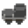
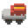

# [Unrailed 2](https://unrailed-game.com/) 랭커를 목표로 하는 이들을 위한 가이드

## Disclaimer

본 가이드는 필자의 경험과 주변 지인의 조언을 바탕으로 작성된 주관적인 가이드입니다.

이 문서를 작성하는 시점(2025 Q1) 기준으로 Unrailed 2는 아직 정식 출시되지 않았기 때문에, 언제든 메타가 바뀔 수 있음을 참고하시기 바랍니다.

## 목차

- [Unrailed 2 랭커를 목표로 하는 이들을 위한 가이드](#unrailed-2-랭커를-목표로-하는-이들을-위한-가이드)
  - [Disclaimer](#disclaimer)
  - [목차](#목차)
  - [누구를 위한 가이드인가요?](#누구를-위한-가이드인가요)
  - [무엇을 배울 수 있나요?](#무엇을-배울-수-있나요)
  - [사전](#사전)
  - [장거리 운행을 위한 팀 빌딩](#장거리-운행을-위한-팀-빌딩)
  - [최신 자료를 얻거나 멤버를 구할 수 있는 곳](#최신-자료를-얻거나-멤버를-구할-수-있는-곳)
  - [개요](#개요)
    - [1. 열차 업그레이드를 통해 철로 생산 자동화](#1-열차-업그레이드를-통해-철로-생산-자동화)
    - [2. 카트리지를 모아 각 플레이어의 역할을 원활히 수행할 수 있는 빌드를 완성](#2-카트리지를-모아-각-플레이어의-역할을-원활히-수행할-수-있는-빌드를-완성)
    - [3. 필수 열차를 제외한 모든 슬롯에 정지차(브레이크차)를 도배하여 최대한 버티기](#3-필수-열차를-제외한-모든-슬롯에-정지차브레이크차를-도배하여-최대한-버티기)
    - [엔진](#엔진)
    - [열차](#열차)
    - [도구](#도구)
    - [카트리지](#카트리지)
    - [도구의 기본 구성과 역할](#도구의-기본-구성과-역할)
    - [기차역과 난이도](#기차역과-난이도)
    - [적과 동물](#적과-동물)
      - [동물 우유 버프](#동물-우유-버프)
      - [보스](#보스)
      - [필드 몬스터](#필드-몬스터)
    - [거리와 속도](#거리와-속도)
    - [볼트](#볼트)
    - [기차 생명](#기차-생명)
  - [랭킹 관련](#랭킹-관련)
  - [개인 테크닉 \& 팁](#개인-테크닉--팁)
  - [맵별 테크닉 \& 팁](#맵별-테크닉--팁)
  - [미션 팁](#미션-팁)
  - [열차별 테크닉 \& 팁](#열차별-테크닉--팁)
  - [기타](#기타)

## 누구를 위한 가이드인가요?

나는 반드시 Unrailed 2 [월드 레코드](https://u2.unrailed-online.com/#/highscore)에 이름 석자를 남겨야겠다는 분들을 위한 가이드입니다.

한편, Unrailed 2가 처음이거나 즐겜을 원한다면, 이 문서를 닫고, 게임을 있는 그대로 즐기시는 것을 추천합니다.

이 문서에선 게임의 기초적인 내용을 서술하지 않으며, 독자는 이미 게임을 어느정도 플레이하여 카트리지를 충분히 해금했고, 게임의 기본적인 매커니즘을 이해하고 있는 것을 전제로 합니다.

## 무엇을 배울 수 있나요?

1. Unrailed 2(이하 언레일드) 게임 세부 매커니즘
2. 최적화된 랭커 팀 빌딩 방법
3. 열차별, 스테이지별 최적 전략
4. 개인 테크닉 및 팁

## [사전](./REFERENCE.md)

이 문서에서는 게임 플레이나 아이템 등에 대한 정보를 서술하지 않습니다. 모르는 부분이 생겼을 땐 [사전](./REFERENCE.md) 문서를 교차 참조하시기 바랍니다.

## 장거리 운행을 위한 팀 빌딩

언레일드는 유구한 전통의 분업 협동 플레이 게임입니다. 공방에서도 충분히 높은 기록을 낼 수 있지만, 월드 레코드 10위권 진입을 노린다면 합이 맞는 팀을 꾸려 진행하는 것이 좋습니다.

공방은 모든 멤버가 고인물이라고 하더라도 세션 중간에 이탈하여 페이스가 깨지는 경우도 있고, 긴급한 헬프콜(철로 보충/이동, 경로 개척 등)을 요청해야 할 때 빠른 의사 소통이 불가능한 문제가 있습니다.

언레일드의 열차 속도는 시간이 지날수록 지수함수적으로 증가합니다. 각 멤버가 적절한 역할을 수행하고 올바른 열차 빌드를 완성했다 할지라도, 초단위를 다투는 극후반부에선 빠른 의사 소통이 되지 않으면 총알같은 열차 속도를 이겨내기 어렵습니다.

일반적으로 팀은 4명의 플레이어로 구성되어 시작부터 역할을 정하여 게임을 함께 시작합니다. 소통은 [Discord](https://discord.com/) 등의 음성 채팅 앱을 이용하는 것이 일반적입니다.

**참고:** `2025-02-01` 패치 이후로 세션 공석에 *새로운* 멤버가 들어오면 해당 멤버가 현재 세션이 지나온 모든 카트리지 보관소에서 원하는 카트리지를 소급하여 선택할 수 있도록 패치되어 이탈자가 생겼을 때 충원된 인원도 게임 재개에 충분한 도움을 줄 수 있게 되었습니다. (단, 소지하고 있는 카트리지를 교환할 수 있는 카트리지 교환소의 선택지는 아직 소급 적용할 수 없는 것으로 보입니다.)

## 최신 자료를 얻거나 멤버를 구할 수 있는 곳

- [Unrailed 2 Wiki](https://wiki.unrailed.gg/index.php/U2_Wiki)
- [Unrailed 2 공식 디스코드](https://discord.gg/unrailed)
- [디시인사이드 언레일드 마이너 갤러리](https://gall.dcinside.com/mgallery/board/lists/?id=unrailed)
- 언레일드 오픈 카카오톡

## 개요

언레일드는 4명의 플레이어가 각자 역할을 나눠 브레이크 없이 계속 직진하는 기차 앞에 철로를 이어 무사히 정거장에 도착하는 것이 목표인 협동 게임입니다.

본 가이드는 **엔드리스 모드**로 [하이스코어 랭킹](https://u2.unrailed-online.com/#/highscore)에서 상위권을 노리는 플레이에 대해 다룹니다.

엔드리스 모드 게임 플레이의 핵심은 다음과 같습니다:

### 1. 열차 업그레이드를 통해 철로 생산 자동화

게임의 후반부에는 기차 속도가 급격히 증가합니다. 이로 인해 플레이어가 직접 철로를 만들기 위해 필요한 자원을 모으고 적재하는데 시간을 쏟기 어려워집니다.

또한, 기차 속도가 빠를 경우 철로 생산 속도가 기차 속도를 따라가지 못할 수 있습니다. 이로 인해 철로가 부족해지는 현상이 발생할 수 있습니다.

따라서, 엔진 종류와 상관없이 철로 제작이 자동으로 진행되도록 열차를 구성하는 것이 중요합니다.

철로 생산 자동화에 필요한 필수 열차와 확장은 다음과 같습니다:

|| 열차 |역할|필요한 확장|비고|
|-|-|-|-|-|
||보관차|나무/돌을 보관하는 역할|자석 도배|시작시 주어짐|
||제작차|나무/돌을 철로로 변환하는 역할|하이드로차지 도배|시작시 주어짐|
||변환차|나무/돌 어느 한 쪽이 부족해도 자동으로 밸런스를 맞춰줌|화물차-가져오기/화물차-보내기 1개씩, 나머지 슈퍼차지 도배|선호에 따라 슈퍼차지 대신 하이드로차지를 넣기도 함|

### 2. 카트리지를 모아 각 플레이어의 역할을 원활히 수행할 수 있는 빌드를 완성

### 3. 필수 열차를 제외한 모든 슬롯에 정지차(브레이크차)를 도배하여 최대한 버티기

열차 속도가 급격하게 증가하는 후반부에서도 어떻게든 역까지 무사히 철로를 이어갈 수 있도록

4. 최종적으로 1번을 위한 열차를 제외한, 남은 열차 슬롯에 정지차(브레이크차)를 도배하고 + 3개의 보관함 슬롯까지 모두 채워 넣기

즉, **빌드를 단시간에 완성**하여, 구상해둔 열차의 구성과 각 플레이어의 역할에 맞는 카트리지를

### 엔진

엔진은 기차의 핵심으로, 각 엔진은 특성과 급수량, 바이옴 시작 속도가 다릅니다.

엔진이 터지면 게임오버가 되며, 푸셔 엔진은 특성상 열차를 엔진보다 앞에 달 수 있기 때문에 엔진 본체가 터지지 않으면 게임 오버가 되지 않습니다.

> [!TIP]
> Q. **급수량**이 무엇인가요?
>
> 급수량은 엔진이 불타지 않고 움직일 수 있는 시간을 의미합니다. 급수량이 다 떨어지면 엔진이 불에 휩싸이기 시작하고, 물통으로 식히지 않으면 불이 옆으로 옮겨붙습니다.

> [!TIP]
> Q. 바이옴 시작 속도가 무엇인가요?
>
> 바이옴 시작 속도는 엔진이 처음에 움직이는 속도를 의미합니다. 엔진이 처음에 움직이는 속도가 빠를수록, 기차가 빨리 움직이기 시작합니다.

### 열차

열차는 엔진에 붙여 기차 기능을 추가하는 역할을 합니다. 게임을 시작하면 기본적으로 보관차와 철로차가 주어지며, 이후에는 상점에서 열차를 구매할 수 있습니다.

**참고:** 사전적 의미의 **열차**는 철도 차량이 여러 개 연결되어 있는 것을 의미하지만 본 문서에선 편의상 개별 철도 차량을 **열차**라고 칭합니다.

### 도구

### 카트리지

### 도구의 기본 구성과 역할

모두의 역할

- 길 개척
- 맵 기믹 파훼
  - 단, 레일맨은 기차길 만드는 것을 우선

나무맨 chopper

- 나무를 캠
- 길 개척

채굴맨 miner

- 돌을 캠

서포터 loader

- 초반에 창고차, 돼지 등에 재료 넣기
- 양동이로 열차 식히기, 버프 주기
- 길 개척
- 후반에 레일맨에게 레일 건네기, 또는 레일 가까이에 내려놓기
- 터렛 활용

레일맨 track placer

- 레일 빼기, 깔기
- 마지막 막타
- 눈치보기
- 힘든 상황에 적당히 시간 끌기
- 경로 선택

### 기차역과 난이도

### 적과 동물

샌드웜은 굴 근처에서 대시를 쓴 사람에게 타겟이 잡히고 대시를 쓸 때마다 대시를 쓴 사람의 자리로 따라가는 특성이 있음.

파란 대시 카트리지 10개를 먹어도 기가 막히게 쫒아와서 플레이어를 날려버림

#### 동물 우유 버프

지형에 따라 다른 종류의 동물이 출현합니다. 양동이를 가지고 동물에게 가져가면 동물 우유를 얻을 수 있습니다.

동물 우유는 플레이어가 먹거나 동료 플레이어에게 먹일 수 있고, 일정 시간동안 특별한 효과를 부여합니다.

**이미지**

**이름**

**효과**

**출현 지형**

**비고**

---

사슴(Deer)

**20초**간 **5개**의 완력 카트리지 효과 부여

모노레일 초지

탈 수 있습니다.

---

악어(Crocodile)

**20초**간 **6개**의 적재 카트리지 효과 부여

박스카 만

탈 수 있습니다.

---

개구리(Frog)

**20초**간 **5개**의 횃불 카트리지 효과 부여

모노레일 초지

사로 잡기 힘들지만, 집어든 상태에서 거미줄 가까이에 가져가면 거미줄을 먹어 치웁니다.

---

게(Crab)

**20초**간 **5개**의 완력 카트리지 효과 부여

환승섬

탈 수 있습니다.

집어든 상태에서 바다물에 들어가면 육지를 만듭니다.

---

슬라임(Waste Slime)

**20초**간 **5개**의 양동이 카트리지 효과 부여

보일러 황무지

맞으면 둘로 쪼개집니다.

---

#### 보스

두더지 보스 폭탄 들어 터트려 길 개척

빅-샌드웜 보스는 빠르게 시작부터 화면 반 이상을 가로지르는 길을 만들면 굴을 뚫지 않고 지나감

항상 끝나는 위치가 동일

브레이크차 대기실에서 쳐지는 버그 관련해서

#### 필드 몬스터

### 거리와 속도

### 볼트

### 기차 생명

죽으면 바로 터지기 직전 역으로 돌아가고, 동일한 맵을 선택할 경우, 방금 플레이한 것과 완전히 동일한 맵이 반복됩니다.

## 랭킹 관련

- 랭킹은 여기서 확인할 수 있습니다.
- 랭킹은 HQ에 도달한 시점이 아닌, 어느 맵에서든 열차가 터진 시점으로 기록됩니다.
- 랭크는 기차별로 구분됩니다.
- 메인 / 레거시
- 던지기 걸어가면서도 쓸 수 있다
- 랭크는 브레이크차 싸움

## 개인 테크닉 & 팁

- 사람이 모인 곳에선 급한 상황이 아니라면 달리기를 하지 않는다
- 초반에 동물 버프를 주기
- 길을 뚫는 사람은 터렛 활용
- 역할별 카트리지 추천
- 길이 1탄이고, 나무꾼/채굴맨이 본인 때문에 길이 막혀 못 들어갈 경우 — 메뉴 → 리스폰 기능을 활용하면 길을 비켜줄 수 있다.
- 리스폰될 때 인풋 연결 해제 후 다시 들어가면 즉시 땅에서 시작
- OpenGL 드라이버 설정으로 밤 이팩트 제거
- 21:9 모니터 / 와이드뷰 / 창모드로 크기 조절하여 끄트머리 보기
- 다리 놓아 길 개척
- 미리 다음 맵에서 사용할 트랙/나무 뽑아놓기
- 자석 카트리지 활용하여 빠르게 나르기
- 터렛으로 호수 밑의 암초 부술 수 있다
- 문어 보스는 나무로 틀어막아서 죽일 수 있음
- 우유는 바닥에 놓고 도끼나 곡괭이 들고 A키로 먹을 수 있다
- 속도 증가는 지수함수?
- 봇에게 물주도록 시킬 수 있다 / 필요하지만 내가 끼기엔 좀 그런 어려움/쉬움 같은 카트리지를 넣을 수 있다
- 쉬움/어려움 카트리지는 서로 상충되지 않는다 / 둘 다 있으면 어려움, 쉬움이 나오고 중간이 없어지는 개념
- 주사위에서 목숨은 1개까지만 킵 가능, 사용해도 다시 먹을 수 있음
- 10개 레일 이상 깔면 바로 시작

## 맵별 테크닉 & 팁

## 미션 팁

2칸 열차는 삐비빅 소리가 들릴 때 하나씩 놓으면 된다.

직선응 열차 끝 지저을 잘 보고 놓기

## 열차별 테크닉 & 팁

- 기본적으로 모든 열차는 보관함 처럼 쓸 수 있습니다. [호환표 첨부]
    - 유령차는 열차에 붙이는 순간 열차 레벨에 따라 슬롯이 더 늘어나므로 공간을 유용하게 쓸 수 있습니다
    - 보관함 슬롯이 부족할 때 이렇게 한 열차에 몰아놓고 대장간에서 분해하여 이식할 수 있습니다.
- 유령차는 카트를 붙일 때 유령 업그레이드가 별도 슬롯으로 붙습니다.
- 이때 대장간에서 카트리지를 날리면 유령도 함께 날아갑니다.
- 한편, 유령차 열차 본체에 연결하지 않으면 유령 기능은 붙지 않은 상태로 유지되므로 제거할 슬롯이 있다면 바로 연결하지 않는게 좋습니다.
- 아니면 사용하지 않고 갈아버릴 남은 열차가 있다면, 열차를 연결하고 다시 분리해서 유령 업그레이드를 이식할 수 있습니다.
- 브레이크차 좋은 비율 시간3 슈차4

## 기타

- 왕관
-
- 거미줄 걸렸을 때 양쪽 연타로 풀려나기
- 용암/해변에서 마지막 지점 미리 나무바닥/돌바닥 깔아두기

푸셔 엔진은 터졌을 때 무조건 철로 잇지 않고 그대로 터트리기
레일 맵 끝에서 한 칸 비워두기

열차마다 시작 속도가 다르다, 칸도 다르고 인게임 상점에서 열차에 가까이 가면 보임

스톰프 쓰면 환승섬 숨은 바위 위로 올라옴?

언레일드의 엔드리스 모드는 일단 모든 바이옴을 한 번씩 순회해야 합니다. 그 이후에는 HQ로 들어가 게임을 끝낼 것인지, 랜덤한 바이옴 두 곳 중 하나를 선택하여 계속 진행할 수 있습니다.

모든 바이옴을 한 번씩 순회하는 동안에는 보스를 쓰러트릴때마다 속도가 거의 초기 속도에 가깝게 줄어듭니다.

한편,
