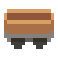
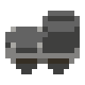
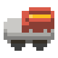
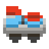

# [Unrailed 2](https://unrailed-game.com/) 랭커를 목표로 하는 이들을 위한 가이드

## Disclaimer

본 가이드는 필자의 경험과 주변 지인의 조언을 바탕으로 작성된 주관적인 가이드입니다.

이 문서를 작성하는 시점(2025 Q1) 기준으로 Unrailed 2는 아직 정식 출시되지 않았기 때문에, 언제든 메타가 바뀔 수 있음을 참고하시기 바랍니다.

## 목차

- [Unrailed 2 랭커를 목표로 하는 이들을 위한 가이드](#unrailed-2-랭커를-목표로-하는-이들을-위한-가이드)
  - [Disclaimer](#disclaimer)
  - [목차](#목차)
  - [누구를 위한 가이드인가요?](#누구를-위한-가이드인가요)
  - [무엇을 배울 수 있나요?](#무엇을-배울-수-있나요)
  - [사전](#사전)
  - [장거리 운행을 위한 팀 빌딩](#장거리-운행을-위한-팀-빌딩)
  - [최신 자료를 얻거나 멤버를 구할 수 있는 곳](#최신-자료를-얻거나-멤버를-구할-수-있는-곳)
  - [개요](#개요)
    - [1. 열차 업그레이드를 통해 철로를 만드는 과정 자동화](#1-열차-업그레이드를-통해-철로를-만드는-과정-자동화)
    - [2. 카트리지를 모아 각 플레이어의 역할을 원활히 수행할 수 있는 빌드를 완성](#2-카트리지를-모아-각-플레이어의-역할을-원활히-수행할-수-있는-빌드를-완성)
    - [3. 필수 열차를 제외한 모든 슬롯에 정지차(브레이크차)를 도배하여 최대한 버티기](#3-필수-열차를-제외한-모든-슬롯에-정지차브레이크차를-도배하여-최대한-버티기)
    - [엔진](#엔진)
    - [열차](#열차)
    - [도구](#도구)
    - [카트리지](#카트리지)
    - [도구의 기본 구성과 역할](#도구의-기본-구성과-역할)
    - [기차역과 난이도](#기차역과-난이도)
    - [적과 동물](#적과-동물)
      - [동물 우유 버프](#동물-우유-버프)
      - [보스](#보스)
      - [필드 몬스터](#필드-몬스터)
    - [거리와 속도](#거리와-속도)
    - [볼트](#볼트)
    - [기차 생명](#기차-생명)
  - [랭킹 관련](#랭킹-관련)
  - [개인 테크닉 \& 팁](#개인-테크닉--팁)
  - [맵별 테크닉 \& 팁](#맵별-테크닉--팁)
  - [미션 팁](#미션-팁)
  - [열차별 테크닉 \& 팁](#열차별-테크닉--팁)
  - [기타](#기타)

## 누구를 위한 가이드인가요?

나는 반드시 Unrailed 2 [월드 레코드](https://u2.unrailed-online.com/#/highscore)에 이름 석자를 남겨야겠다는 분들을 위한 가이드입니다.

한편, Unrailed 2가 처음이거나 즐겜을 원한다면, 이 문서를 닫고, 게임을 있는 그대로 즐기시는 것을 추천합니다.

이 문서에선 게임의 기초적인 내용을 서술하지 않으며, 독자는 이미 게임을 어느정도 플레이하여 카트리지를 충분히 해금했고, 게임의 기본적인 매커니즘을 이해하고 있는 것을 전제로 합니다.

## 무엇을 배울 수 있나요?

1. Unrailed 2(이하 언레일드) 게임 세부 매커니즘
2. 최적화된 랭커 팀 빌딩 방법
3. 열차별, 스테이지별 최적 전략
4. 개인 테크닉 및 팁

## [사전](./REFERENCE.md)

이 문서에서는 게임 플레이나 아이템 등에 대한 정보를 서술하지 않습니다. 모르는 부분이 생겼을 땐 [사전](./REFERENCE.md) 문서를 교차 참조하시기 바랍니다.

## 장거리 운행을 위한 팀 빌딩

언레일드는 유구한 전통의 분업 협동 플레이 게임입니다. 공방에서도 충분히 높은 기록을 낼 수 있지만, 월드 레코드 10위권 진입을 노린다면 합이 맞는 팀을 꾸려 진행하는 것이 좋습니다.

공방은 모든 멤버가 고인물이라고 하더라도 세션 중간에 이탈하여 페이스가 깨지는 경우도 있고, 긴급한 헬프콜(철로 보충/이동, 경로 개척 등)을 요청해야 할 때 빠른 의사 소통이 불가능한 문제가 있습니다.

언레일드의 열차 속도는 시간이 지날수록 지수함수적으로 증가합니다. 각 멤버가 적절한 역할을 수행하고 올바른 열차 빌드를 완성했다 할지라도, 초단위를 다투는 극후반부에선 빠른 의사 소통이 되지 않으면 총알같은 열차 속도를 이겨내기 어렵습니다.

일반적으로 팀은 4명의 플레이어로 구성되어 시작부터 역할을 정하여 게임을 함께 시작합니다. 소통은 [Discord](https://discord.com/) 등의 음성 채팅 앱을 이용하는 것이 일반적입니다.

**참고:** `2025-02-01` 패치 이후로 세션 공석에 *새로운* 멤버가 들어오면 해당 멤버가 현재 세션이 지나온 모든 카트리지 보관소에서 원하는 카트리지를 소급하여 선택할 수 있도록 패치되어 이탈자가 생겼을 때 충원된 인원도 게임 재개에 충분한 도움을 줄 수 있게 되었습니다. (단, 소지하고 있는 카트리지를 교환할 수 있는 카트리지 교환소의 선택지는 아직 소급 적용할 수 없는 것으로 보입니다.)

## 최신 자료를 얻거나 멤버를 구할 수 있는 곳

- [Unrailed 2 Wiki](https://wiki.unrailed.gg/index.php/U2_Wiki)
- [Unrailed 2 공식 디스코드](https://discord.gg/unrailed)
- [디시인사이드 언레일드 마이너 갤러리](https://gall.dcinside.com/mgallery/board/lists/?id=unrailed)
- 언레일드 오픈 카카오톡

## 개요

언레일드는 4명의 플레이어가 각자 역할을 나눠 브레이크 없이 계속 직진하는 기차 앞에 철로를 이어 무사히 정거장에 도착하는 것이 목표인 협동 게임입니다.

본 가이드는 **엔드리스 모드**로 [하이스코어 랭킹](https://u2.unrailed-online.com/#/highscore)에서 상위권을 노리는 플레이에 대해 다룹니다.

엔드리스 모드 게임 플레이의 핵심은 다음과 같습니다:

### 1. 열차 업그레이드를 통해 철로를 만드는 과정 자동화

게임의 후반부에는 열차 속도가 급격히 증가합니다. 이로 인해 플레이어가 직접 철로를 만들기 위해 필요한 자원을 모으고 적재하는데 시간을 쏟기 어려워집니다.

또한, 기차 속도가 빠를 경우 철로 생산 속도가 기차 속도를 따라가지 못할 수 있습니다. 이로 인해 철로가 부족해지는 현상이 발생할 수 있습니다.

따라서, 엔진 종류와 상관없이 철로 제작이 자동으로 진행되도록 열차를 구성하는 것이 중요합니다.

철로 생산 자동화에 필요한 열차와 확장은 다음과 같습니다:

||열차|역할|필요한 확장|비고|
|-|-|-|-|-|
||보관차|나무/돌을 보관하는 역할|자석 도배|시작시 주어짐|
||철로차|나무/돌을 철로로 변환하는 역할|하이드로차지 도배|시작시 주어짐|
||변환차|나무/돌 어느 한 쪽이 부족해도 자동으로 밸런스를 맞춰줌|가져오기/보내기 1개씩, 나머지 슈퍼차지 도배||
||맥-트랙터|나무/돌을 자동으로 모으는 역할 수행|범위 증가 도배|만약, 보조가 한 라운드가 끝나기 전에 자원을 모아 적재하는데 익숙하다면 필수가 아님|

