# 사전

> 이 문서는 **Unrailed 2 영문 커뮤니티 위키를 번역하여 필자의 사족을 덧붙여 옮겨온 문서입니다.** 내용에는 오역이 있을 수 있으며, 번역 과정에서 일부 정보가 생략됐을 수 있습니다.
>
> 원본 문서는 [Unrailed 2 Wiki](https://wiki.unrailed.gg/index.php/U2_Wiki)를 참조하세요.

이 문서는 알려진 Unrailed 2 정보를 정량적인 데이터로 참조할 수 있는 레퍼런스를 제공합니다.

메인 가이드와 더불어 교차 참조해주시면 더욱 풍부한 정보를 얻을 수 있습니다.

## 목차

- [사전](#사전)
  - [목차](#목차)
  - [기차역](#기차역)
    - [역 종류](#역-종류)
      - [상점](#상점)
        - [가격](#가격)
      - [대장간](#대장간)
        - [업그레이드 가격](#업그레이드-가격)
      - [상자](#상자)
      - [???](#)
      - [슬롯 머신](#슬롯-머신)
      - [카트리지 교환소](#카트리지-교환소)
      - [바이옴 교차](#바이옴-교차)
      - [카트리지 보관소](#카트리지-보관소)
      - [UnRailD HQ](#unraild-hq)
    - [역 난이도](#역-난이도)
      - [쉬움](#쉬움)
      - [보통](#보통)
      - [어려움](#어려움)
      - [극단](#극단)
    - [역 옵션 (수정자)](#역-옵션-수정자)
      - [동물](#동물)
      - [볼트 두 배](#볼트-두-배)
      - [긴맵](#긴맵)
      - [할인](#할인)
      - [추가 재고](#추가-재고)
  - [카트리지](#카트리지)
    - [액션 카트리지](#액션-카트리지)
      - [X](#x)
      - [제트팩](#제트팩)
      - [파워 스톰프](#파워-스톰프)
      - [서둘러(달리기)](#서둘러달리기)
      - [던지기](#던지기)
      - [안장](#안장)
      - [유령](#유령)
    - [패시브 카트리지](#패시브-카트리지)
      - [X](#x-1)
      - [터보-도끼](#터보-도끼)
      - [터보-곡괭이](#터보-곡괭이)
      - [무거운 풍선](#무거운-풍선)
      - [횃불](#횃불)
      - [질주](#질주)
      - [더블 달리기](#더블-달리기)
      - [막대사탕](#막대사탕)
      - [어려움](#어려움-1)
      - [멀티툴](#멀티툴)
      - [양동이](#양동이)
      - [완력](#완력)
      - [자석](#자석)
      - [긴맵](#긴맵-1)
      - [추가 하트](#추가-하트)
      - [돌진 철거](#돌진-철거)
      - [럭키 펀치](#럭키-펀치)
      - [돈복사기](#돈복사기)
      - [할인](#할인-1)
  - [맵(바이옴)](#맵바이옴)
    - [모노레일 초지](#모노레일-초지)
    - [박스카 만](#박스카-만)
    - [화물 계곡](#화물-계곡)
    - [환승섬](#환승섬)
    - [보일러 황무지](#보일러-황무지)
    - [UnRailD HQ](#unraild-hq-1)
  - [열차](#열차)
    - [기본 제공 열차](#기본-제공-열차)
      - [제작차](#제작차)
      - [화물차](#화물차)
    - [일반 열차](#일반-열차)
      - [수집차](#수집차)
      - [컨베이어 벨트차](#컨베이어-벨트차)
      - [맥-트랙터](#맥-트랙터)
      - [대포차](#대포차)
      - [보관차](#보관차)
      - [변환차](#변환차)
      - [슬롯머신차](#슬롯머신차)
      - [다이너마이트차](#다이너마이트차)
      - [채굴차](#채굴차)
      - [어뢰차](#어뢰차)
      - [터렛차](#터렛차)
      - [브레이크차 (정지차)](#브레이크차-정지차)
      - [유령차](#유령차)
      - [탱크차 (물탱크)](#탱크차-물탱크)
      - [과급차](#과급차)
      - [우유차](#우유차)
    - [특별 열차](#특별-열차)
      - [돼지 저금통](#돼지-저금통)
      - [카트리지 토스터](#카트리지-토스터)
      - [열차 프린터](#열차-프린터)
      - [헥스너트 나무차](#헥스너트-나무차)
      - [과제차](#과제차)
      - [VS차](#vs차)
  - [열차 확장](#열차-확장)
    - [열차 확장 종류](#열차-확장-종류)
      - [화물차 가져오기](#화물차-가져오기)
      - [화물차 보내기](#화물차-보내기)
      - [앞차에서 가져오기](#앞차에서-가져오기)
      - [자동으로 떨구기](#자동으로-떨구기)
      - [자석](#자석-1)
      - [유령](#유령-1)
      - [하이드로차지](#하이드로차지)
      - [슈퍼차지](#슈퍼차지)
      - [범위 확장](#범위-확장)
      - [속도 부스트](#속도-부스트)
      - [적재 부스트](#적재-부스트)
      - [시간 확장](#시간-확장)
      - [열쇠](#열쇠)
    - [열차 확장 호환성 표](#열차-확장-호환성-표)
  - [엔진](#엔진)
    - [하이드로 콜러](#하이드로-콜러)
    - [장난감 엔진](#장난감-엔진)
    - [푸셔 엔진](#푸셔-엔진)
    - [스펙트럼 익스프레스 (유령 엔진)](#스펙트럼-익스프레스-유령-엔진)
  - [도구](#도구)
    - [도끼](#도끼)
    - [곡괭이](#곡괭이)
    - [양동이](#양동이-1)
  - [자원](#자원)
    - [압축된 자원](#압축된-자원)
  - [볼트](#볼트)
    - [볼트 파밍 방법](#볼트-파밍-방법)
  - [기차 속도](#기차-속도)
    - [기차 속도계](#기차-속도계)
    - [실제 속도](#실제-속도)
    - [역에서 출발시 준비 시간](#역에서-출발시-준비-시간)
    - [전략](#전략)
    - [초기 바이옴별 시작 속도](#초기-바이옴별-시작-속도)
    - [속도 증가율](#속도-증가율)
  - [급수량](#급수량)
    - [급수량 게이지](#급수량-게이지)
    - [하이드로차지 열차 확장 관련](#하이드로차지-열차-확장-관련)
    - [터렛차 관련](#터렛차-관련)
    - [물차 관련](#물차-관련)
  - [우유](#우유)
  - [Credits](#credits)

## 기차역

기차역(이하 역)은 역에서 역으로 이어진 맵(레벨) 하나를 클리어할 때마다 기차를 잠시 정차하고 재정비할 수 있는 장소입니다.

보스 클리어시 출현하는 환승역을 제외한 모든 역에는 기본적으로, **볼트 하나를 소모하여 도전할 수 있는 추가 과제 하나**와 **열차 또는 열차 확장을 최대 3개까지 보관할 수 있는 보관함**이 있습니다.

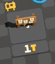

### 역 종류

#### 상점

상점은 열차와 열차 확장을 구매할 수 있는 역입니다.

모든 상점은 **4개의 열차**와 **3개의 열차** 확장을 판매합니다.

판매대 주변에 새로고침 버튼처럼 생긴 발판이 있는데, 이 발판에서 상호작용 버튼을 누르면 현재 역에서 한 행동을 모두 역에 도착했을 당시의 상태로 되돌릴 수 있습니다.

[추가 재고 옵션](#추가-재고)이 붙은 역은 상점에서 판매되는 열차 확장의 개수가 1개 더 추가됩니다.

[극단 난이도](#극단)의 상점은 판매되는 열차가 모두 2레벨 업그레이드가 되어 있는 상태로 판매됩니다.

상점은 일반적으로 랭커들이 **가장 선호하는 첫번째 역**입니다. 게임을 시작했을 때 첫번째 역으로 상점이 나오지 않는 경우 게임을 중단하고 다시 시작하는 일명 리세마라를 하기도 합니다.

##### 가격

[할인 옵션](#할인)이 붙은 역은 판매되는 아이템이 할인된 가격으로 제공됩니다.

할인 옵션이 없는 일반 상점은 다음과 같은 조합의 열차를 판매합니다:

- **아무 열차 확장이 붙지 않은** 열차 1개
- **열차 확장**이 붙은 열차 2개
- **디버프를 주는 열차 확장이 붙은** 열차 1개

|                         | 일반 가격            | 할인 가격            |
| ----------------------- | -------------------- | -------------------- |
| 열차 확장(이하 확장)    | ![볼트][icon-bolt] 4 | ![볼트][icon-bolt] 3 |
| 확장 없는 열차          | ![볼트][icon-bolt] 4 | ![볼트][icon-bolt] 3 |
| 확장 있는 열차          | ![볼트][icon-bolt] 5 | ![볼트][icon-bolt] 4 |
| 디버프 확장이 붙은 열차 | ![볼트][icon-bolt] 3 | ![볼트][icon-bolt] 2 |

극단 난이도에선 다음과 같은 조합의 열차를 판매합니다:

- 열차 확장이 **1개** 붙은 열차 1개
- 열차 확장이 **2개** 붙은 열차 2개
- 열차 확장이 **3개** 붙은 열차 1개

|                      | 일반 가격            | 할인 가격            |
| -------------------- | -------------------- | -------------------- |
| 열차 확장(이하 확장) | ![볼트][icon-bolt] 4 | ![볼트][icon-bolt] 3 |
| 확장이 1개 붙은 열차 | ![볼트][icon-bolt] 5 | ![볼트][icon-bolt] 4 |
| 확장이 2개 붙은 열차 | ![볼트][icon-bolt] 6 | ![볼트][icon-bolt] 5 |
| 확장이 3개 붙은 열차 | ![볼트][icon-bolt] 7 | ![볼트][icon-bolt] 6 |

#### 대장간

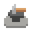

대장간에서는 열차를 업그레이드하고, 열차 확장을 추가, 추출 또는 제거할 수 있습니다. 작업대에 열차를 올려놓으면 바로 밑에 기능 버튼이 활성화됩니다.

또한, 대장간에선 ![볼트][icon-bolt] 4개를 소모하여 구입할 수 있는 열차 확장 3개를 판매합니다. ([할인 옵션](#할인)이 있는 대장간에선 ![볼트][icon-bolt] 3개를 소모합니다)

대장간 작업대에 열차를 올려놓으면 다음과 같은 옵션이 제공됩니다:

- **🚫 확장 해체:** 열차에 들어있는 모든 확장을 제거합니다. 제거된 확장은 반환되지 않습니다.
- **♻️ 재활용:** 열차를 파괴하고, 열차에 장착된 확장을 모두 추출합니다.
- **⬆️ 업그레이드:** 열차 레벨을 증가시킵니다.

상점과 마찬가지로, 땅에 있는 되돌리기 버튼을 사용하여 열차에 대한 모든 변경 사항을 되돌릴 수 있습니다.

[추가 재고 옵션](#추가-재고)이 붙은 대장간은 판매되는 열차 확장의 개수가 1개 더 추가됩니다.

##### 업그레이드 가격

[할인 옵션](#할인)이 붙은 대장간은 업그레이드 가격이 할인된 가격으로 제공됩니다.

|                | 일반 가격                 | 할인 가격                 |
| -------------- | ------------------------- | ------------------------- |
| **레벨 1 > 2** | ![볼트][icon-bolt] 3      | ![볼트][icon-bolt] 2      |
| **레벨 2 > 3** | ![볼트][icon-bolt] 4      | ![볼트][icon-bolt] 3      |
| **레벨 3 > 4** | ![볼트][icon-bolt] 6      | ![볼트][icon-bolt] 5      |
| **레벨 4 > 5** | ![볼트][icon-bolt] 12     | ![볼트][icon-bolt] 10     |
| **레벨 5 > 6** | ![볼트][icon-bolt] 24     | ![볼트][icon-bolt] 22     |
| **총합**       | ![볼트][icon-bolt] **49** | ![볼트][icon-bolt] **42** |

#### 상자

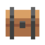

상자 역에선 열차, 열차 확장, 카트리지가 랜덤하게 출현합니다.

대부분의 경우 3개의 열차 확장 **또는** 3개의 열차를 제공합니다.

역에서 출현하는 열차는 확장을 가지고 나오는 경우도 있지만 디버프 확장이 달린 경우도 있습니다.

아주 가끔씩 랜덤한 카트리지 3개를 제공하는 상자역이 출현하기도 하는데, 단 한 명의 플레이어가 1개의 카트리지만 가져갈 수 있습니다.

다른 역과 마찬가지로 땅에 되돌리기 버튼이 있고, 이 버튼을 누르면 상자역에서 한 행동을 모두 역에 도착했을 당시의 상태로 되돌릴 수 있습니다.

[추가 재고 옵션](#추가-재고)이 붙은 상자역은 판매되는 선택할 수 있는 아이템이 1개 더 추가됩니다.

#### ???

물음표 역은 바이옴마다 하나씩 존재하는 역으로, 일반적으로 5번째 역에서 출현할 확률이 높습니다. (선택한 경로는 이에 영향을 주지 않습니다)

물음표 역은 특수 열차를 제공하고 바이옴마다 서로 다른 특성을 가지고 있습니다.

| 바이옴                          | 열차                                |
| ------------------------------- | ----------------------------------- |
| [모노레일 초지](#모노레일-초지) | [돼지 저금통](#돼지-저금통)         |
| [박스카 만](#박스카-만)         | [열차 프린터](#열차-프린터)         |
| [화물 계곡](#화물-계곡)         | [카트리지 토스터](#카트리지-토스터) |
| [환승섬](#환승섬)               | [헥스너트 나무차](#헥스너트-나무차) |
| [보일러 황무지](#보일러-황무지) | [과제차](#과제차)                   |

#### 슬롯 머신

슬롯 머신 역은 소지하고 있는 볼트를 걸고 열차 속도를 늦추거나 랜덤한 카트리지를 얻는 도박을 할 수 있습니다.

역에는 두 개의 슬롯 머신이 있고 슬롯 머신을 작동시키려면 모든 플레이어가 동시에 발판 위에 서 있어야 합니다.

한 번 돌리는데 드는 비용은 ![볼트][icon-bolt] **4개**입니다. ([할인 옵션](#할인)이 붙은 슬롯 머신 역에선 ![볼트][icon-bolt] **3개**)

슬롯 머신은 최대 4번까지 돌릴 수 있고 4번째 회전에서 **무조건** 성공합니다.

한 번 성공한 슬롯 머신은 비활성화됩니다.

카트리지 슬롯 머신()은 성공시 모두에게 동일한 카트리지 1개를 랜덤하게 제공합니다.

참고로 카트리지 슬롯 머신에선 [ 막대사탕](#막대사탕), [ 어려움](#어려움-1), [ 긴맵](#긴맵-1
) 카트리지는 출현하지 않습니다.

속도 슬롯 머신(![속도][icon-speed])은 성공시 기차 속도를 약간 감소시킵니다. (대략적으로 게임 초반 다음 역으로 진행할 때 증가하는 속도 만큼 줄어듭니다. 따라서, 기차 속도가 너무 빠를 땐 줄어드는 속도가 증가하는 속도보다 한참 떨어지게 됩니다)

두 슬롯 머신 모두 성공시 아주 낮은 확률로  추가 체력을 얻을 수 있습니다.

열차가 이미 추가 체력을 가진 경우나 장난감 엔진을 사용하는 경우에는 추가 체력을 얻을 수 없습니다.

추가 체력을 가진 상태에서 기차가 터질 경우 터지기 직전 역으로 돌아가고, 추가 체력은 사라지게 됩니다.

추가 체력은 기차 속도계 옆에 하트 모양으로 표시됩니다.

추가 체력을 가진 상태에서 기차가 터지고, 같은 맵을 다시 시도할 경우 해당 맵은 이전에 **기차가 터진 맵과 완전히 동일한 모양으로 생성**되기 때문에 미리 기차가 터진 맵을 기억해두면 좋습니다.

랭커가 랭크런을 뛸 때 한 번의 실수가 수 시간을 갈아 넣은 기차를 터뜨리는 경우가 많기 때문에, 추가 체력을 얻기 위해 슬롯 머신을 많이 활용합니다.

확실한 정보는 아니지만(공식 디스코드발 소문; 모더레이터), 바이옴을 넘어갈 때마다 슬롯 머신 역이 출현할 확률이 점점 낮아진다고 합니다.

정확히는, 이전 바이옴에서 방문한 슬롯 머신 역의 개수의 2배수 만큼 더 지나야 슬롯 머신 역이 출현한다고 합니다.

#### 카트리지 교환소

카트리지 교환소는 소유한 카트리지를 다른 카트리지로 교환할 수 있는 역입니다.

역에는 3개의 교환기가 있습니다.

가장 왼쪽에 있는 첫번째 교환기는 **가지고 있는 카트리지를 빈 카트리지**로 교환해줍니다. 빈 카트리지는 다음 카트리지 교환을 할 때 가장 먼저 결정론적으로 소모됩니다.

오른쪽 2개의 교환기는 플레이어가 가진 카트리지 중 랜덤하게 하나를 교환기 발판 위에 그려진 카트리지로 교환해줍니다. 이 때, 만약 빈 카트리지가 있다면 빈 카트리지가 가장 먼저 소모됩니다.

모든 교환기는 교환 **5회 횟수 제한**이 있습니다.

액션 카트리지는 이 역에서 출현하지 않습니다.

교환기는 볼트와 같은 다른 재화를 소모하지 않습니다.

[추가 재고 옵션](#추가-재고)이 붙은 카트리지 교환소는 교환기에 카트리지가 1개 더 추가됩니다.

#### 바이옴 교차

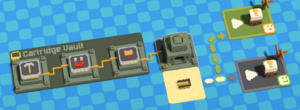

바이옴 교차는 각 바이옴의 보스를 쓰러트리고 도착하는 역으로, 다음 바이옴으로 넘어가기 전 잠시 정비할 수 있는 역입니다.

각 플레이어는 새로운 카트리지를 하나 선택할 수 있습니다:

- 일반 카트리지 2개
- 액션 카트리지 업그레이드
- 새로운 액션 카트리지

오른편에는 넘어갈 수 있는 새로운 바이옴 2개가 출현합니다. 바이옴을 선택하면 기차 속도가 초기 상태로 초기화됩니다. (첫번째 루프 한정)

첫번째 루프에선 총 6개의 바이옴을 모두 지나야 하고, 5번째 바이옴에서 6번째로 넘어갈 때 출현하는 바이옴 교차는 단 1개의 바이옴만 선택할 수 있습니다.

6개의 바이옴을 모두 클리어하면 유저는 UnRailD HQ로 들어가 게임을 끝낼지, 아니면 다음 바이옴을 선택해 계속 진행할지 선택할 수 있습니다.

다음 바이옴으로 진행할 경우 바이옴 발판 오른쪽에 난이도가 표시되며, 이는 **기차 시작 속도**에 영향을 미칩니다.

처음 6개의 바이옴을 클리어하고 이후 바이옴이 바뀔때마다 점점 기차 속도가 깎이는 폭이 줄어들기 때문에 기차 속도가 점점 빨라지게 됩니다.

다른 역과는 다르게 이 역은 추가 과제, 열차 보관소, **되돌리기 버튼**이 없습니다.

즉, 보스전에 한 번 진입하면 보스를 끝낸 후 다음 바이옴으로 넘어가는 첫번째 역까지는 기차를 수정할 수 없습니다.

마찬가지로 이 역에서 수집하는 카트리지는 한 번 먹으면 되돌리기가 불가능하기 때문에 먹는 도중 서로 밀치지 않도록 주의해야 합니다.

다음 바이옴으로 넘어가는 경우, 항상 상점 역이 첫번째 역으로 출현합니다.

#### 카트리지 보관소

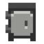

카트리지 보관소는 [극단 난이도](#극단)에서만 출현하는 역으로, 랜덤한 카트리지를 제공합니다.

역에는 2개의 카트리지 보관함이 있고 카트리지 1개를 선택해 가져갈 수 있습니다.

[추가 재고 옵션](#추가-재고)이 붙은 카트리지 보관소는 카트리지 선택지에 1개가 더 추가됩니다.

카트리지 보관소는 랭크런을 달릴 때 후반 빌드업을 위해 가장 많이 들려야 하는 역입니다.

#### UnRailD HQ

6번째 바이옴까지 모두 클리어한 이후 바이옴 교차에서 선택할 수 있는 마지막 종착역입니다.

UnRailD HQ로 진행하길 선택한 경우 개발자 크레딧과 함께 엔딩을 보게 됩니다.

크레딧을 모두 보고 나면 기차는 무조건 터지고 게임이 마무리됩니다.

HQ로 들어갈 경우 약 60~70m 정도 거리의 맵을 가로지릅니다. 장난감 기차 운용시 더 이상 다음 맵으로 진행할 수 없는 속도에 다다랐을 때 활용하면 조금이나마 기록을 더 늘릴 수 있습니다.

참고로, 현재 버그(2025-04-02 기준)로 엔진이 차고지를 박고 터진 이후, 그 뒤로 철로를 더 깔 수 있습니다.

### 역 난이도

역 난이도는 4개의 난이도로 나뉩니다. 맨 처음부터 시작하는 게임의 맵은 **쉬움** 난이도로 시작합니다.

역에 도착하면 다음 역으로 가는 발판 아래에 난이도 아이콘이 표시됩니다.

난이도가 더 높아질 수록 레벨 클리어시 더 많은 볼트를 획득할 수 있습니다.

#### 쉬움

**보상: ![볼트][icon-bolt] x1**

쉬움 난이도는 다음 역으로 가는 경로 사이에 장애물이 없습니다.

나무와 바위를 캐지 않아도 다음 역까지 진행할 수 있는 경로가 확보되어 있고, 산의 경우 단순하게 되어 있어 대부분의 경우 우회하지 않고도 다음 역에 도달할 수 있습니다.

땅과 땅 사이에 호수 물길이 있을 수 있지만 1개 타일을 넘지 않습니다.

도착하는 역이 상자역인 경우, 출현하는 무료 열차에 열차 능력치를 저하시키는 **디버프 열차 확장**이 들어있을 확률이 있습니다.

#### 보통

**보상: ![볼트][icon-bolt] x3**

보통 난이도는 일반적으로 나무와 바위 같은 자원이 다음 역으로 가는 경로를 막고 있습니다.

한편, 여전히 산으로 인해 경로를 우회해야 하는 경우는 드뭅니다.

또한, 호수가 넓지 않아 매우 긴 다리를 만드는 것이 강제되지 않습니다.

#### 어려움

**보상: ![볼트][icon-bolt] x4**

어려움 난이도는 더 많은 산과 호수로 이루어져 있습니다. 자원이 듬성듬성하게 배치되어 있어 자원 관리가 중요합니다.

한편, 산과 산 사이 좁은 통로로 전진해야 하는 경우는 많지 않습니다.

도착하는 역이 상자역인 경우, 출현하는 무료 열차에 열차의 능력치를 향상시키는 **일반 열차 확장**이 들어있을 확률이 있습니다.

#### 극단

**보상: ![볼트][icon-bolt] x5**

극단 난이도는 매우 드물게 출현하는 난이도로(어려움 카트리지가 없는 한) 맵 내에 자원이 매우 부족하게 배치되어 있습니다.

또한, 산과 산 사이에 기차만 겨우 지나갈 수 있는 한 칸짜리 좁은 통로가 최소 1개 이상 출현합니다.

극단 난이도에서 도착하는 역은 거의 항상 무료 카트리지를 제공하는 **카트리지역**이며, 그렇지 않은 경우 추가 **역 옵션**이 붙게 됩니다.

### 역 옵션 (수정자)

어떤 역은 역 난이도 표시 옆에 추가적인 옵션(modifiers)을 가지고 있습니다.

#### 동물

동물이 더 많이 출현합니다.

#### 볼트 두 배

숨겨진 볼트가 두 배로 출현합니다.

#### 긴맵

일반 맵보다 15m 더 긴 맵입니다.

**참고:** 일반 맵 기장은 31m 입니다.

#### 할인

역에서 판매되는 모든 아이템이 1개의 볼트(![볼트][icon-bolt]) 만큼 할인됩니다.

대장간역에서 열차 업그레이드를 구매할 때도 할인이 적용되며, 업그레이드당 1-2개의 볼트가 할인됩니다.

참고로, 추가 과제는 항상 1개의 볼트가 소모되기 때문에 이 옵션을 가진 역에서 출현하는 추가 과제는 항상 **무료**입니다.

#### 추가 재고

역에서 판매되는 모든 아이템의 개수가 1개 더 추가됩니다.

## 카트리지

### 액션 카트리지

#### X

#### 제트팩

#### 파워 스톰프

#### 서둘러(달리기)

#### 던지기

#### 안장

#### 유령

### 패시브 카트리지

#### X

#### 터보-도끼

#### 터보-곡괭이

#### 무거운 풍선

#### 횃불

#### 질주

#### 더블 달리기

#### 막대사탕

#### 어려움

#### 멀티툴

#### 양동이

#### 완력

#### 자석

#### 긴맵

#### 추가 하트

#### 돌진 철거

#### 럭키 펀치

#### 돈복사기

#### 할인

## 맵(바이옴)

### 모노레일 초지

### 박스카 만

### 화물 계곡

### 환승섬

### 보일러 황무지

### UnRailD HQ

## 열차

### 기본 제공 열차

#### 제작차

#### 화물차

### 일반 열차

#### 수집차

#### 컨베이어 벨트차

#### 맥-트랙터

#### 대포차

#### 보관차

#### 변환차

#### 슬롯머신차

#### 다이너마이트차

#### 채굴차

#### 어뢰차

#### 터렛차

#### 브레이크차 (정지차)

#### 유령차

#### 탱크차 (물탱크)

#### 과급차

#### 우유차

### 특별 열차

#### 돼지 저금통

#### 카트리지 토스터

#### 열차 프린터

#### 헥스너트 나무차

#### 과제차

#### VS차

## 열차 확장

열차 확장은 [상점](#상점)과 [상자](#상자) [대장간](#대장간) 역에서 구입할 수 있는 아이템으로, 열차에 장착하여 사용할 수 있습니다.

[유령 열차](#스펙트럼-익스프레스-유령-엔진)를 제외하고 모든 열차는 최대 3개의 열차 확장을 장착할 수 있습니다.

열차에 넣은 열차 확장은 개별적으로 제거할 수 없으며, [대장간](#대장간)에서 장착된 모든 확장을 제거할 수 있습니다.

모든 열차 확장이 모든 열차에 호환되지 않습니다. 또한, 열차에 따라 영향을 주는 특성이 조금씩 다릅니다.

열차 확장의 효과는 각 열차 항목을 참조하세요.

### 열차 확장 종류

#### 화물차 가져오기

근처 화물차에서 자원을 자동으로 가져옵니다. [철](#자원)이 더 높은 우선순위를 가집니다.

조건이 "근처 화물차"이므로 바로 옆에 있지 않고, 열차 반대편 끝에 있는 화물차에서도 자원을 가져올 수 있습니다.

#### 화물차 보내기

근처 화물차에 자원을 자동으로 보냅니다.

#### 앞차에서 가져오기

앞에 있는 열차로부터 자동으로 자원을 가져옵니다.

#### 자동으로 떨구기

열차 생산품(다이너마이트/어뢰)을 완성될 때마다 활성화되지 않은 상태로 자동으로 바닥에 떨어트립니다.

#### 자석

자석은 2m 이내에 있는 자원을 자동으로 가져옵니다. 2개째 추가되는 자석 확장부터는 +1m 만큼의 거리가 추가로 증가합니다.

#### 유령

장착한 열차를 통과할 수 있게 만듭니다.

유령 열차 하나가 더 효율이 좋아 잘 사용되지 않습니다.

#### 하이드로차지

열차 레벨을 2 증가시키지만 급수 게이지가 추가됩니다. (엔진에 붙어있는 것과 비슷함)

급수 게이지는 열차가 활성화 상태일 때 점점 줄어들며, 게이지가 모두 줄어들면 열차가 불에 타게 됩니다.

자세한 내용은 [급수량](#급수량) 항목을 참조하세요.

#### 슈퍼차지

열차 레벨을 1 증가시킵니다.

#### 범위 확장

열차 또는 생산품의 영향 범위를 증가시킵니다. 열차의 종류와 열차 레벨에 따라 증가량이 달라집니다.

#### 속도 부스트

열차의 작업 속도를 증가시킵니다. 열차의 종류와 열차 레벨에 따라 증가량이 달라집니다.

#### 적재 부스트

자원 적재가 되는 열차에서 최대 자원 적재량을 증가시킵니다.

#### 시간 확장

자원을 사용하거나 활성화 시간이 있는 열차의 지속 시간을 늘려줍니다.

#### 열쇠

현재 게임내 사용처가 없습니다.

### 열차 확장 호환성 표

아래 표는 각 열차 확장과 호환되는 열차를 보여줍니다. 열차 확장의 효과는 각 열차 항목을 참조하세요.

|                                                               |  |  |  |  |  |  |  |  |  |  |  |  |  |
| ------------------------------------------------------------- | --------------------------------------------------------------------------- | ----------------------------------------------------------------------- | ----------------------------------------------------------------------------- | ------------------------------------------------------------------------ | ---------------------------------------------------- | ---------------------------------------------- | -------------------------------------------------------------------- | ------------------------------------------------------------ | ------------------------------------------------------------------ | ------------------------------------------------------------------ | ------------------------------------------------------------------ | ----------------------------------------------------------------- | -------------------------------------------- |
|                    | ![✅][misc-checkmark]                                                        | ![❌][misc-crossmark]                                                    | ![✅][misc-checkmark]                                                          | ![✅][misc-checkmark]                                                     | ![✅][misc-checkmark]                                 | ![✅][misc-checkmark]                           | ![✅][misc-checkmark]                                                 | ![✅][misc-checkmark]                                         | ![❌][misc-crossmark]                                               | ![✅][misc-checkmark]                                               | ![✅][misc-checkmark]                                               | ![❌][misc-crossmark]                                              | ![✅][misc-checkmark]                         |
|                    | ![❌][misc-crossmark]                                                        | ![❌][misc-crossmark]                                                    | ![✅][misc-checkmark]                                                          | ![❌][misc-crossmark]                                                     | ![✅][misc-checkmark]                                 | ![✅][misc-checkmark]                           | ![✅][misc-checkmark]                                                 | ![✅][misc-checkmark]                                         | ![❌][misc-crossmark]                                               | ![❌][misc-crossmark]                                               | ![✅][misc-checkmark]                                               | ![❌][misc-crossmark]                                              | ![✅][misc-checkmark]                         |
| 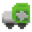                 | ![✅][misc-checkmark]                                                        | ![✅][misc-checkmark]                                                    | ![✅][misc-checkmark]                                                          | ![✅][misc-checkmark]                                                     | ![✅][misc-checkmark]                                 | ![✅][misc-checkmark]                           | ![✅][misc-checkmark]                                                 | ![✅][misc-checkmark]                                         | ![✅][misc-checkmark]                                               | ![✅][misc-checkmark]                                               | ![✅][misc-checkmark]                                               | ![✅][misc-checkmark]                                              | ![✅][misc-checkmark]                         |
|      | ![❌][misc-crossmark]                                                        | ![✅][misc-checkmark]                                                    | ![❌][misc-crossmark]                                                          | ![❌][misc-crossmark]                                                     | ![✅][misc-checkmark]                                 | ![✅][misc-checkmark]                           | ![❌][misc-crossmark]                                                 | ![✅][misc-checkmark]                                         | ![✅][misc-checkmark]                                               | ![❌][misc-crossmark]                                               | ![✅][misc-checkmark]                                               | ![❌][misc-crossmark]                                              | ![✅][misc-checkmark]                         |
|             | ![✅][misc-checkmark]                                                        | ![❌][misc-crossmark]                                                    | ![✅][misc-checkmark]                                                          | ![❌][misc-crossmark]                                                     | ![✅][misc-checkmark]                                 | ![✅][misc-checkmark]                           | ![✅][misc-checkmark]                                                 | ![✅][misc-checkmark]                                         | ![✅][misc-checkmark]                                               | ![❌][misc-crossmark]                                               | ![✅][misc-checkmark]                                               | ![✅][misc-checkmark]                                              | ![✅][misc-checkmark]                         |
| 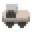                    | ![✅][misc-checkmark]                                                        | ![❌][misc-crossmark]                                                    | ![✅][misc-checkmark]                                                          | ![❌][misc-crossmark]                                                     | ![✅][misc-checkmark]                                 | ![✅][misc-checkmark]                           | ![❌][misc-crossmark]                                                 | ![✅][misc-checkmark]                                         | ![✅][misc-checkmark]                                               | ![✅][misc-checkmark]                                               | ![✅][misc-checkmark]                                               | ![❌][misc-crossmark]                                              | ![✅][misc-checkmark]                         |
| 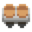                  | ![✅][misc-checkmark]                                                        | ![❌][misc-crossmark]                                                    | ![✅][misc-checkmark]                                                          | ![❌][misc-crossmark]                                                     | ![✅][misc-checkmark]                                 | ![✅][misc-checkmark]                           | ![❌][misc-crossmark]                                                 | ![✅][misc-checkmark]                                         | ![❌][misc-crossmark]                                               | ![❌][misc-crossmark]                                               | ![✅][misc-checkmark]                                               | ![❌][misc-crossmark]                                              | ![✅][misc-checkmark]                         |
|                | ![✅][misc-checkmark]                                                        | ![✅][misc-checkmark]                                                    | ![✅][misc-checkmark]                                                          | ![✅][misc-checkmark]                                                     | ![✅][misc-checkmark]                                 | ![✅][misc-checkmark]                           | ![✅][misc-checkmark]                                                 | ![✅][misc-checkmark]                                         | ![❌][misc-crossmark]                                               | ![✅][misc-checkmark]                                               | ![✅][misc-checkmark]                                               | ![❌][misc-crossmark]                                              | ![✅][misc-checkmark]                         |
|           | ![❌][misc-crossmark]                                                        | ![❌][misc-crossmark]                                                    | ![❌][misc-crossmark]                                                          | ![❌][misc-crossmark]                                                     | ![❌][misc-crossmark]                                 | ![✅][misc-checkmark]                           | ![✅][misc-checkmark]                                                 | ![✅][misc-checkmark]                                         | ![❌][misc-crossmark]                                               | ![✅][misc-checkmark]                                               | ![✅][misc-checkmark]                                               | ![❌][misc-crossmark]                                              | ![✅][misc-checkmark]                         |
| 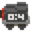          | ![✅][misc-checkmark]                                                        | ![❌][misc-crossmark]                                                    | ![✅][misc-checkmark]                                                          | ![✅][misc-checkmark]                                                     | ![✅][misc-checkmark]                                 | ![✅][misc-checkmark]                           | ![✅][misc-checkmark]                                                 | ![✅][misc-checkmark]                                         | ![✅][misc-checkmark]                                               | ![✅][misc-checkmark]                                               | ![❌][misc-crossmark]                                               | ![❌][misc-crossmark]                                              | ![✅][misc-checkmark]                         |
| 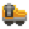                     | ![✅][misc-checkmark]                                                        | ![❌][misc-crossmark]                                                    | ![✅][misc-checkmark]                                                          | ![❌][misc-crossmark]                                                     | ![✅][misc-checkmark]                                 | ![✅][misc-checkmark]                           | ![✅][misc-checkmark]                                                 | ![✅][misc-checkmark]                                         | ![✅][misc-checkmark]                                               | ![✅][misc-checkmark]                                               | ![✅][misc-checkmark]                                               | ![✅][misc-checkmark]                                              | ![✅][misc-checkmark]                         |
| 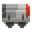                   | ![✅][misc-checkmark]                                                        | ![❌][misc-crossmark]                                                    | ![✅][misc-checkmark]                                                          | ![✅][misc-checkmark]                                                     | ![✅][misc-checkmark]                                 | ![✅][misc-checkmark]                           | ![✅][misc-checkmark]                                                 | ![✅][misc-checkmark]                                         | ![✅][misc-checkmark]                                               | ![✅][misc-checkmark]                                               | ![❌][misc-crossmark]                                               | ![❌][misc-crossmark]                                              | ![✅][misc-checkmark]                         |
| 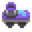              | ![❌][misc-crossmark]                                                        | ![❌][misc-crossmark]                                                    | ![❌][misc-crossmark]                                                          | ![❌][misc-crossmark]                                                     | ![❌][misc-crossmark]                                 | ![✅][misc-checkmark]                           | ![✅][misc-checkmark]                                                 | ![✅][misc-checkmark]                                         | ![✅][misc-checkmark]                                               | ![✅][misc-checkmark]                                               | ![❌][misc-crossmark]                                               | ![❌][misc-crossmark]                                              | ![✅][misc-checkmark]                         |
|                  | ![❌][misc-crossmark]                                                        | ![❌][misc-crossmark]                                                    | ![❌][misc-crossmark]                                                          | ![❌][misc-crossmark]                                                     | ![❌][misc-crossmark]                                 | ![✅][misc-checkmark]                           | ![❌][misc-crossmark]                                                 | ![✅][misc-checkmark]                                         | ![❌][misc-crossmark]                                               | ![❌][misc-crossmark]                                               | ![❌][misc-crossmark]                                               | ![✅][misc-checkmark]                                              | ![✅][misc-checkmark]                         |
|                      | ![❌][misc-crossmark]                                                        | ![❌][misc-crossmark]                                                    | ![❌][misc-crossmark]                                                          | ![❌][misc-crossmark]                                                     | ![❌][misc-crossmark]                                 | ![❌][misc-crossmark]                           | ![❌][misc-crossmark]                                                 | ![✅][misc-checkmark]                                         | ![❌][misc-crossmark]                                               | ![❌][misc-crossmark]                                               | ![❌][misc-crossmark]                                               | ![❌][misc-crossmark]                                              | ![✅][misc-checkmark]                         |
|               | ![❌][misc-crossmark]                                                        | ![❌][misc-crossmark]                                                    | ![❌][misc-crossmark]                                                          | ![❌][misc-crossmark]                                                     | ![❌][misc-crossmark]                                 | ![✅][misc-checkmark]                           | ![❌][misc-crossmark]                                                 | ![✅][misc-checkmark]                                         | ![❌][misc-crossmark]                                               | ![❌][misc-crossmark]                                               | ![❌][misc-crossmark]                                               | ![❌][misc-crossmark]                                              | ![✅][misc-checkmark]                         |
|               | ![✅][misc-checkmark]                                                        | ![❌][misc-crossmark]                                                    | ![✅][misc-checkmark]                                                          | ![❌][misc-crossmark]                                                     | ![✅][misc-checkmark]                                 | ![✅][misc-checkmark]                           | ![✅][misc-checkmark]                                                 | ![✅][misc-checkmark]                                         | ![❌][misc-crossmark]                                               | ![❌][misc-crossmark]                                               | ![✅][misc-checkmark]                                               | ![✅][misc-checkmark]                                              | ![✅][misc-checkmark]                         |
| 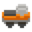                 | ![✅][misc-checkmark]                                                        | ![✅][misc-checkmark]                                                    | ![✅][misc-checkmark]                                                          | ![✅][misc-checkmark]                                                     | ![✅][misc-checkmark]                                 | ![✅][misc-checkmark]                           | ![✅][misc-checkmark]                                                 | ![✅][misc-checkmark]                                         | ![❌][misc-crossmark]                                               | ![✅][misc-checkmark]                                               | ![✅][misc-checkmark]                                               | ![❌][misc-crossmark]                                              | ![✅][misc-checkmark]                         |
| 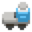                      | ![❌][misc-crossmark]                                                        | ![❌][misc-crossmark]                                                    | ![❌][misc-crossmark]                                                          | ![❌][misc-crossmark]                                                     | ![❌][misc-crossmark]                                 | ![✅][misc-checkmark]                           | ![❌][misc-crossmark]                                                 | ![✅][misc-checkmark]                                         | ![❌][misc-crossmark]                                               | ![✅][misc-checkmark]                                               | ![✅][misc-checkmark]                                               | ![❌][misc-crossmark]                                              | ![✅][misc-checkmark]                         |
|                    | ![✅][misc-checkmark]                                                        | ![❌][misc-crossmark]                                                    | ![✅][misc-checkmark]                                                          | ![❌][misc-crossmark]                                                     | ![✅][misc-checkmark]                                 | ![✅][misc-checkmark]                           | ![❌][misc-crossmark]                                                 | ![✅][misc-checkmark]                                         | ![❌][misc-crossmark]                                               | ![❌][misc-crossmark]                                               | ![❌][misc-crossmark]                                               | ![❌][misc-crossmark]                                              | ![✅][misc-checkmark]                         |
|  | ![❌][misc-crossmark]                                                        | ![❌][misc-crossmark]                                                    | ![❌][misc-crossmark]                                                          | ![❌][misc-crossmark]                                                     | ![❌][misc-crossmark]                                 | ![✅][misc-checkmark]                           | ![❌][misc-crossmark]                                                 | ![✅][misc-checkmark]                                         | ![❌][misc-crossmark]                                               | ![❌][misc-crossmark]                                               | ![❌][misc-crossmark]                                               | ![❌][misc-crossmark]                                              | ![✅][misc-checkmark]                         |
| 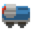         | ![❌][misc-crossmark]                                                        | ![❌][misc-crossmark]                                                    | ![✅][misc-checkmark]                                                          | ![❌][misc-crossmark]                                                     | ![✅][misc-checkmark]                                 | ![✅][misc-checkmark]                           | ![❌][misc-crossmark]                                                 | ![✅][misc-checkmark]                                         | ![❌][misc-crossmark]                                               | ![❌][misc-crossmark]                                               | ![❌][misc-crossmark]                                               | ![❌][misc-crossmark]                                              | ![✅][misc-checkmark]                         |
|        | ![❌][misc-crossmark]                                                        | ![❌][misc-crossmark]                                                    | ![❌][misc-crossmark]                                                          | ![❌][misc-crossmark]                                                     | ![❌][misc-crossmark]                                 | ![✅][misc-checkmark]                           | ![❌][misc-crossmark]                                                 | ![✅][misc-checkmark]                                         | ![❌][misc-crossmark]                                               | ![✅][misc-checkmark]                                               | ![❌][misc-crossmark]                                               | ![❌][misc-crossmark]                                              | ![✅][misc-checkmark]                         |
|                 | ![❌][misc-crossmark]                                                        | ![❌][misc-crossmark]                                                    | ![❌][misc-crossmark]                                                          | ![❌][misc-crossmark]                                                     | ![❌][misc-crossmark]                                 | ![✅][misc-checkmark]                           | ![❌][misc-crossmark]                                                 | ![✅][misc-checkmark]                                         | ![❌][misc-crossmark]                                               | ![❌][misc-crossmark]                                               | ![❌][misc-crossmark]                                               | ![❌][misc-crossmark]                                              | ![✅][misc-checkmark]                         |
| 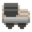                | ![❌][misc-crossmark]                                                        | ![❌][misc-crossmark]                                                    | ![❌][misc-crossmark]                                                          | ![✅][misc-checkmark]                                                     | ![❌][misc-crossmark]                                 | ![✅][misc-checkmark]                           | ![✅][misc-checkmark]                                                 | ![✅][misc-checkmark]                                         | ![✅][misc-checkmark]                                               | ![✅][misc-checkmark]                                               | ![❌][misc-crossmark]                                               | ![❌][misc-crossmark]                                              | ![❌][misc-crossmark]                         |

## 엔진

엔진은 모든 기차의 핵심으로 게임 시작시에만 교체할 수 있습니다.

엔진이 파괴되는 경우 게임오버됩니다.

엔진은 서로 다른 특성을 가지지만 밸런스를 위해 최대 열차 개수, [급수량](#급수량), 바이옴 시작 속도에 차이가 있습니다.

별다른 설명이 없는 이상, 모든 엔진은 바이옴을 넘어갈 때마다 최대 열차 개수가 **1개씩 증가**하며, 총 **13개**의 열차를 장착할 수 있습니다.

### 하이드로 콜러

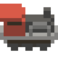

![속도][icon-speed] **시작 속도:** 1번째 역

![열차][icon-wagon] **최대 열차 개수:** 5게

![물][icon-water] **급수량:** 60초

하이드로 콜러는 기본 시작 엔진으로 균형 잡힌 성능을 가지고 있습니다.

### 장난감 엔진

![속도][icon-speed] **시작 속도:** 1번째 역

![열차][icon-wagon] **최대 열차 개수:** 4개

![물][icon-water] **급수량:** 60초

장난감 엔진은 하트가 무제한으로, 기차가 터져도 마지막 역으로 돌아가 다시 시작할 수 있습니다.

리더보드에 하이스코어가 기록되기는 하지만 기차가 최대로 터진 횟수 순서대로 (5 -> 10 -> Any) 기록에 남습니다.

### 푸셔 엔진

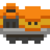

![속도][icon-speed] **시작 속도:** 4번째 역

![열차][icon-wagon] **최대 열차 개수:** 6개

![물][icon-water] **급수량:** 40초

푸셔 엔진은 장착하는 열차의 위치를 엔진보다 앞에 달 수도 있는 특성을 가지고 있습니다.

푸셔 엔진은 엔진 본체가 터지지 않는 이상 엔진에 달린 열차가 터진 상태로 역에 들어갈 경우 "클리어"로 인정됩니다.

즉, 제작차나 화물차 같이 중요한 열차가 터진 상태로 역에 들어갈 경우 그 열차가 없는 상태 그대로 클리어됩니다.

이 말은 즉슨, 슬롯머신 맵에서 추가 하트를 얻었더라도 하트를 쓸 수 있는 마지막 세이브 지점에 **제작차와 화물차가 없는 기차가 저장**되고, 어차피 기차는 제작차나 화물차가 없어서 더 이상 선로를 만들 수 없으므로 사실상 게임이 터진 것이나 다름이 없습니다.

추가 하트가 있는 상태에서, 속도가 빠른 후반부 버티기를 안전하게 하려면 차라리 일반 엔진처럼 열차를 앞에 두는 것이 더 안전합니다.

### 스펙트럼 익스프레스 (유령 엔진)

![속도][icon-speed] **시작 속도:** 4번째 역

![열차][icon-wagon] **최대 열차 개수:** 5개

![물][icon-water] **급수량:** 40초

스펙트럼 익스프레스는 유령 열차 확장이 엔진에 적용된 특성을 가지고 있습니다.

최대 열차 개수는 시작과 동시에 5개로 제한되며, 바이옴을 클리어해도 더 늘어나지 않습니다.

엔진에 장착되는 모든 새로운 열차는 총 4개의 확장 슬롯을 가지고, 1회에 한해 첫번째 슬롯에 자동으로 유령 열차 확장을 얻습니다.

또한, 모든 열차는 2개의 바이옴을 지날때마다 1개의 추가 열차 확장 슬롯이 생깁니다.

참고로, 기본적으로 모든 열차 슬롯은 최대 3개이나, 유령 열차에 연결하는 순간 현재 엔진의 레벨(바이옴을 지나온 횟수) 만큼 슬롯이 더 늘어나게 됩니다.

어떤 열차를 게임 후반부에 사용할 열차 확장을 보관하기 위한 재물로써 / 보관함처럼 사용할 때 잠시 기차에 연결했다가 빼내는 방법으로 보관할 수 있는 임시 슬롯을 더 늘릴 수 있습니다.

## 도구

도구는 역에서 열차가 출발할 때 주어지는 아이템으로 나무나 철을 캐고 열차 열을 식히는데 사용합니다.

모든 도구는 던질 수 있습니다.

도구를 든 상태로 나무나 바위에 다가가면 자원을 캘 수 있습니다. 별도의 버튼을 누를 필요는 없습니다.

이 때, 캐릭터가 나무/바위를 3번 찍으면 자원으로 바뀝니다.

### 도끼

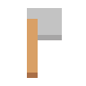

도끼는 맵에 펼쳐진 나무를 캐고 나무 자원을 획득하는데 사용합니다.

터보-도끼 카트리지를 활용하여 캐는 속도를 높일 수 있고, 멀티툴 카트리지를 활용해 바위도 캐는데 사용할 수 있습니다. 완력 카트리지를 얻으면 여러 나무를 한 번에 캘 수 있습니다.

NPC를 공격할 때 한 번의 공격으로 1데미지를 입힙니다.

### 곡괭이

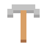

곡괭이는 맵에 펼쳐진 바위를 캐고 돌 자원을 획득하는데 사용합니다.

터보-곡괭이 카트리지를 활용하여 캐는 속도를 높일 수 있고, 멀티툴 카트리지를 활용해 나무도 캐는데 사용할 수 있습니다. 완력 카트리지를 얻으면 여러 바위를 한 번에 캘 수 있습니다.

NPC를 공격할 때 한 번의 공격으로 1데미지를 입힙니다.

### 양동이

**물통**이라고도 불립니다.

양동이는 엔진의 급수량 게이지를 초기화시키거나 불이 났을 때 불을 끄는데 사용합니다.

언레일드 전작과 달리, 본작에선 양동이를 사용하려면 엔진에 대고 상호작용 키를 눌러야 합니다.

양동이를 들고 동물에게 다가가면 동물 [우유](#우유
)를 얻을 수 있습니다.

우유가 담긴 양동이를 든 플레이어 본인이 우유를 마시려면 양동이를 바닥에 내려놓고 도구를 든 상태로 상호작용 키를 눌러야 합니다. 이 때 양동이는 다시 손에 들리지 않습니다.

양동이에 담긴 우유는 가까이 다가가서 상호 작용키를 누르거나, 던지기를 활용해서 다른 플레이어에게 줄 수도 있습니다.

던지기 액션 카트리지를 장착한 플레이어는 다음과 같은 행동과 특성을 가집니다:

1. 양동이가 빈 경우, 다른 플레이어에게 바로 던지거나 우유차 또는 카트리지차에 던져 넣을 수 있습니다.
2. 양동이가 물로 채워져있을 경우, 1번을 포함하여 열차나 엔진에 던져 급수량 게이지를 초기화하거나 불을 끌 수 있고 이때 던진 양동이는 다시 손으로 돌아옵니다.
3. 양동이가 우유로 채워져있을 경우, 위 내용 모두 동일하나, 다른 플레이어에게 던질 경우 대상에게 우유를 먹이고 양동이가 다시 손으로 돌아옵니다.

## 자원

| 형상                                    | 이름   | 역할                               | 비고                                                                                                                                                                           |
| --------------------------------------- | ------ | ---------------------------------- | ------------------------------------------------------------------------------------------------------------------------------------------------------------------------------ |
|    | 나무   | 철로 제작, **물 위에 다리 만들기** | 다음 라운드 시작시 육로로 넘어갈 수 있는 길이 없을 경우, 물을 건너가기 위한 길을 만들어야 하기 때문에 전 라운드에서 나무를 미리 모아두는 것을 추천합니다. (보일러 황무지 제외) |
|  | 철(돌) | 철로 제작                          | N/A                                                                                                                                                                            |

열차 중 자원을 넣어야 동작하는 열차가 있습니다. 맥-트랙터와 같이 넣은 자원에 따라 효과가 달라지는 열차도 있습니다.

설정상으로는 필드의 바위를 캐면 나오는 자원이 철이라고 되어 있지만, 국내 커뮤니티에선 "돌"이라고 칭하는 경우가 많습니다. (필자도 돌로 알고 있었습니다..)

두더지 같은 적대 NPC를 잡으면 자원을 무더기로 떨구기도 합니다.

### 압축된 자원

압축된 자원은 조금 일반 자원보다 탁한 색을 띄고 있습니다. 압축된 자원은 일반 자원보다 5배의 효율을 가지고 있습니다. 다시 말해, 압축된 자원 1개를 넣으면 일반 자원 5개로 취급하기 때문에 압축된 자원 한 세트로 철로 5개를 만들 수 있습니다.

| 형상                                                      | 이름          | 역할                               | 비고                                                                                                            |
| --------------------------------------------------------- | ------------- | ---------------------------------- | --------------------------------------------------------------------------------------------------------------- |
|    | 압축된 나무   | 철로 제작, **물 위에 다리 만들기** | 압축된 나무로 물 위에 다리를 만들 경우 2x2 크기로 만들어지기 때문에, 일반 나무로 만든 다리보다 더 효율적입니다. |
| 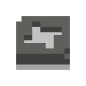 | 압축된 철(돌) | 철로 제작                          | N/A                                                                                                             |

압축된 자원은 일반 자원과 함께 들 수 없습니다. 같은 종류의 자원끼리만 들 수 있습니다. 같은 맥락으로, 바닥에 내려놓을 때도 같은 종류의 자원끼리만 쌓아서 내려놓을 수 있습니다. (e.g., 일반 나무 1개 + 압축된 나무 2개 = 불가)

## 볼트

볼트는 매 게임 세션내에서 파밍할 수 있는 재화입니다. 볼트는 상점에서 열차나 열차 확장과 같은 업그레이드를 구매할 때 사용됩니다.

- **상점**에서 열차, 열차 확장 구입
- **대장간**에서 열차 업그레이드, 열차 확장 구입
- 각 **정거장**에서 유료 퀘스트 구입
- 보스룸 입장권 구입

### 볼트 파밍 방법

- 성공적으로 기차역에 도착하면 난이도에 따라 볼트를 얻을 수 있습니다. ([역 난이도별 볼트 개수](#역-난이도))
- 퀘스트 완수
- 맵에 랜덤하게 출현하는 볼트 1-2개 직접 획득
- 돼지차를 이용하여 파밍

## 기차 속도

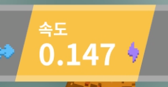

기차 속도는 기차가 전진하는 속도를 의미합니다.

언레일드는 기차 속도를 **가상의 미터법(m)** 으로 표현하는데요, **1m**는 맵의 타일 1칸을 의미합니다.

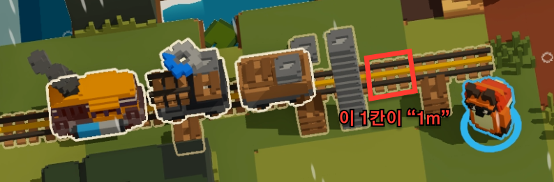

### 기차 속도계

기차차의 현재 속도는 게임 화면의 상단에 표시되며, 다음과 같은 요소의 합산으로 계산됩니다:

- 엔진 자체의 시작 속도
- 바이옴의 시작 속도
- 현재까지 지나온 역의 수
- 바이옴 한 세트(모든 바이옴 한 번씩 돌기)를 반복한 횟수

보스전에 진입하면 기차 속도가 특정 속도로 고정되거나 일정한 규칙에 따라 느려집니다.

기차의 속도는 역에 도달할 때마다 증가하며, 역과 역 사이 구간에선 속도가 일정하게 유지됩니다.

또한, 기차 속도는 플레이어 수에 따라 변화합니다. 플레이어 수가 많아질 수록 기차차 속도가 더 빨라집니다. 이는 풀방이 아닌 상태로 게임을 진행하다 플레이어가 난입하는 경우에도 실시간으로 적용되며 기차차 속도가 갑자기 빨라질 수 있습니다.

바이옴 사이클을 한 바퀴 돈 이후, 이미 플레이한 바이옴에 다시 방문할 경우 방문한 횟수 만큼 기본 시작 속도가 0.5m/s로 증가합니다.

[WIP: 이 내용은 아직 검증되지 않았습니다; 일부 소스에선 2번째 바이옴 시작 속도가 0.261m/s로 나와서 검증이 필요합니다.]

### 실제 속도

대부분의 경우, 기차의 **실제 속도**는 기차 속도계에 표현된 것과 완전히 동일하지 않을 수 있습니다.

기차의 실제 속도는 기차 앞에 놓아진 철로의 개수에 따라 가변적으로 변화합니다.

기차 앞에 철로가 3개 이하로 놓인 경우 현재 속도계에 표시된 속도보다 느리게 움직입니다.

**역주:** 추가로, 타임 어택 모드에서 테스트를 해봤을 때 앞에 연결된 선로가 많을 경우(10+), 열차 속도가 순간적으로 조금 더 빨라지는 것을 확인했습니다.

### 역에서 출발시 준비 시간

기차가 역에서 출발하기 전, **15초의 준비 시간**이 주어집니다.

이 때, 기차는 도착한 역의 타일에서 0.5m 만큼 전진한 상태로 시작합니다.

만약 플레이어가 출발 준비 시간 도중에 철로를 10개를 초과하여 연결할 경우, **초과된 철로의 개수 만큼 1초씩 준비 시간이 줄어듭니다**.

여기서 주의할 점은, 시작 지점에 따라 역에서 출발하는 기차 앞에 2-3개의 철로가 미리 깔려있다는 점입니다.

`2025-03-08` 기점으로 현재 버그인지 확인되지는 않았으나, 0.5m 만큼 전진한 상태 + 2-3개의 철로가 미리 깔려있기 때문에 6-7개를 초과하는 철로를 연결할 경우 출발 카운트다운이 갑자기 끝나는 현상이 발생할 수 있습니다.

랭크런에서 기차 속도가 10m/s가 넘는 경우, 철로 개수를 잘못 계산하여 일찍 출발하면 정지차 사용 타이밍이 틀어져 참사가 발생하므로, 위 내용을 상기하여 철로를 6개까지만 미리 연결하는 것이 안전합니다.

### 전략

실제 속도 특성을 활용하여, 시간을 벌어야 할 때, 철로를 기차 앞 3칸까지만 연결하여 기차 속도를 낮추는 방법이 있습니다. 한편, 이 방법은 최후의 수단으로 버티기를 할 때 사용하는 것이 좋습니다.

또한, 철길을 꼬아 루프를 만드는 방법도 시간 벌기에 효과적입니다. 단, 이렇게 철길을 꼬는 방법은 많은 자원 소모가 필요하므로 주의가 필요합니다.

그 외에도 정지차를 활용하여 기차 속도를 늦추는 방법도 있습니다.

### 초기 바이옴별 시작 속도

게임을 처음 시작할 때 선택한 시작 바이옴에 따라 기차 출발 속도가 달라집니다.

이 속도는 시작 바이옴에 따라 N개의 역을 반복한 횟수 만큼으로 결정됩니다.

| 바이옴        | 시작 속도 지점 (역 개수) |
| ------------- | ------------------------ |
| 모노레일 초지 | 0개                      |
| 화물 계곡     | 2개                      |
| 박스카 만     | 2개                      |
| 환승섬        | 3개                      |
| 보일러 황무지 | 4개                      |

### 속도 증가율

아래는 시작 역에 따른 기차의 기반 속도와 플레이어 수에 따른 속도 변화를 나타내는 표입니다.

| 역 개수 | 1명   | 2명   | 3명   | 4명   |
| ------- | ----- | ----- | ----- | ----- |
| 1       | 0.040 | 0.050 | 0.080 | 0.100 |
| 2       | 0.046 | 0.056 | 0.087 | 0.108 |
| 3       | 0.056 | 0.066 | 0.098 | 0.119 |
| 4       | 0.067 | 0.077 | 0.111 | 0.133 |
| 5       | 0.079 | 0.089 | 0.125 | 0.147 |
| 6       | 0.092 | 0.102 | 0.140 | 0.163 |
| 7       | 0.106 | 0.116 | 0.156 | 0.180 |
| 8       | 0.120 | 0.130 | 0.173 | 0.198 |
| 9       | 0.136 | 0.146 | 0.190 | 0.217 |
| 10      | 0.152 | 0.162 | 0.209 | 0.237 |
| 11      | 0.169 | 0.179 | 0.229 | 0.258 |
| 12      | 0.187 | 0.197 | 0.250 | 0.280 |
| 13      | 0.206 | 0.216 | 0.272 | 0.304 |
| 14      | 0.227 | 0.237 | 0.295 | 0.328 |
| 15      | 0.249 | 0.259 | 0.321 | 0.355 |
| 16      | 0.273 | 0.283 | 0.347 | 0.383 |
| 17      | 0.298 | 0.308 | 0.376 | 0.413 |
| 18      | 0.325 | 0.335 | 0.407 | 0.446 |
| 19      | 0.355 | 0.365 | 0.440 | 0.480 |
| 20      | 0.388 | 0.398 | 0.476 | 0.518 |
| 21      | 0.424 | 0.434 | 0.515 | 0.559 |
| 22      | 0.463 | 0.473 | 0.558 | 0.604 |
| 23      | 0.507 | 0.517 | 0.606 | 0.653 |
| 24      | 0.555 | 0.565 | 0.658 | 0.706 |
| 25      | 0.609 | 0.619 | 0.716 | 0.766 |
| 26      | 0.670 | 0.680 | 0.780 | 0.832 |
| 27      | 0.738 | 0.748 | 0.852 | 0.906 |
| 28      | 0.815 | 0.825 | 0.933 | 0.988 |
| 29      | 0.902 | 0.912 | 1.024 | 1.081 |
| 30      | 1.001 | 1.011 | 1.126 | 1.186 |
| 31      | 1.113 | 1.123 | 1.243 | 1.304 |
| 32      | 1.241 | 1.251 | 1.375 | 1.438 |

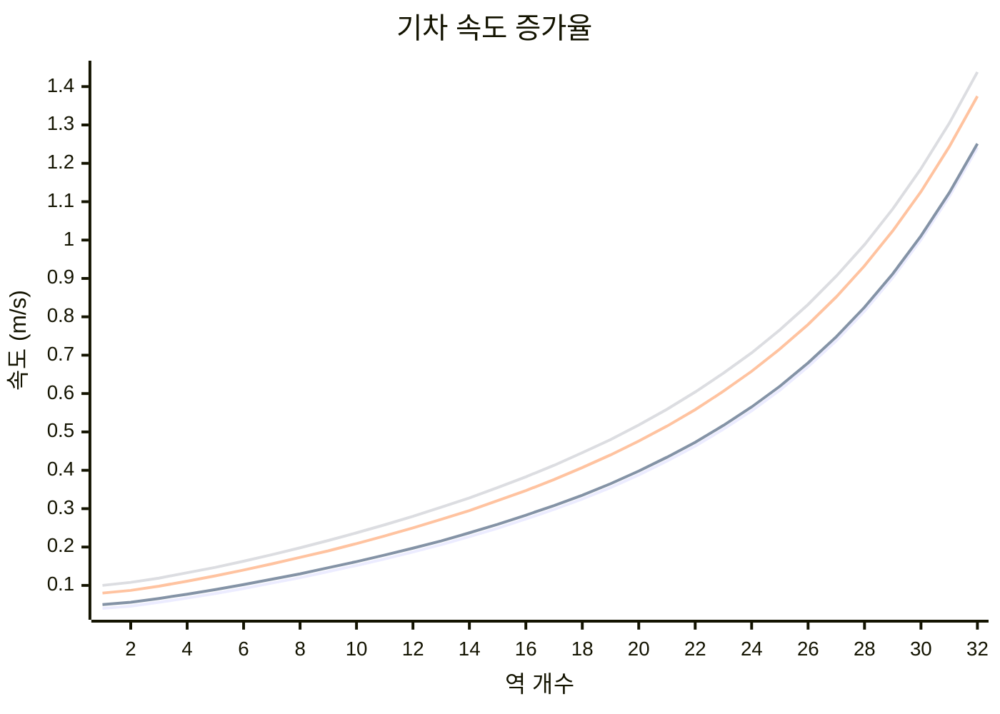

## 급수량

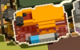

엔진은 움직일 때마다 급수량 게이지가 감소합니다. 급수량 게이지가 다 떨어지면 엔진이 불에 타게 됩니다.

양동이를 이용하여 급수량 게이지를 즉시 초기화할 수 있습니다.

엔진마다 급수량이 다릅니다. 자세한 내용은 [엔진](#엔진)을 참조하세요.

**엔진과 개별 열차를 불문하고, 불에 타는 열차는 인접한 열차를 불 태울 수 있습니다.**

특히, 제작차가 불탈 경우 게임 진행에 매우 치명적이기 때문에 양동이 이용하여 급수량 게이지를 초기화하는 것이 중요합니다.

한편, **엔진 자체**는 다른 인접한 열차가 불에 탄다고 해서 더 빨리 불에 타지 않습니다.

|      |               |          |
| ---- | ------------- | -------- |
| 열차 | 열차(🔥화르륵) | **엔진** |

같은 맥락으로, 연속된 3개의 열차의 양쪽 열차가 불에 타는 경우 그 사이에 낀 열차는 2배의 속도로 불에 타지 않습니다.

아래 그림에서 **열차B**는 양쪽이 불탄다고 해서 더 빨리 **불에 타지 않습니다**.

|                |           |                |      |
| -------------- | --------- | -------------- | ---- |
| 열차A(🔥화르륵) | **열차B** | 열차C(🔥화르륵) | 엔진 |

### 급수량 게이지

게임 내에선 표시되지 않지만, 모든 열차는 숨겨진 급수량 게이지를 가지고 있습니다.

터렛을 제외한 대부분의 열차는 따로 하이드로차지 열차 확장이 없다는 가정하에 초기 급수량이 30초입니다.

하이드로차지 열차 확장을 추가할 경우, 확장을 추가할 때마다 열차의 급수량 게이지를 20초 증가시킵니다.

여기서 주의할 점은 언급된 30초가 실제 시간 30초를 의미하지 않습니다. 하이드로차지 열차 확장의 경우 개수가 늘어날 때마다 곱연산으로 물 소모량이 증가하기 때문에 실제로는 동일한 시간이 소요됩니다.

예를 들어, 열차에 하이드로차지 3개를 도배했다면, 열차는 `30초 + 20초 * 3 = 90초`의 급수량을 가지게 됩니다. 한편, 열차가 활성화된 상태라면 3배의 속도로 급수량 게이지가 감소하므로 `90초 / 3 = 30초`가 되어 열차가 불에 타기까지 걸리는 시간은 변하지 않습니다.

숨겨진 급수량 게이지는 인접한 열차가 불에 탈 경우 점점 감소합니다. (열차가 달궈지는듯한 시각 효과가 있습니다)

열차가 불에 타기 전에 인접한 열차의 불이 꺼진 경우 숨겨진 급수량 게이지는 자동으로 회복되긴 하지만, 불에 달궈진 시간만큼 기다려야 완전히 회복됩니다.

예를 들어, 열차가 인접한 불타는 열차에 의해 20초 동안 달궈졌다 불이 꺼질 경우, 숨겨진 급수량 게이지는 20초만큼 감소했다가 다시 20초에 걸쳐 회복됩니다.

### 하이드로차지 열차 확장 관련

하이드로차지 열차 확장을 사용할 경우 사용한 열차가 활성화 상태일 때를 기준으로 **급수량** 게이지가 감소합니다.

여기서 "활성화 상태"란, 제작차를 기준으로 철로를 제작할 때와 같이 뭔가 일을 하는 상태를 뜻합니다.

따라서, 하이드로차지를 사용했다 하더라도 열차가 활성화 상태가 아니라면 급수량 게이지가 감소하지 않습니다.

하이드로차지가 중첩될 경우 급수량 게이지 감소량은 곱연산으로 계산됩니다.

### 터렛차 관련

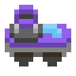

터렛차의 경우 급수량 게이지가 기본적으로 달려있습니다.

따라서, 열차 확장도 하이드로차지로 도배하는 것이 이득입니다.

### 물차 관련

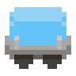

물차를 제외한 모든 열차는 급수량은 서로 분리되어 있습니다.

물차의 급수량 게이지는 열차 전체의 급수량처럼 공유됩니다.

물차가 여러 대 있을 경우, 모든 물차의 급수량 게이지가 합쳐진 용량이 열차의 급수량 게이지가 됩니다.

각 열차는 물차의 급수량 게이지를 먼저 소모하고 나서 자신의 급수량 게이지를 소모합니다.

이는 물차 자신도 마찬가지라서, 물차가 물을 모두 소모한 시점에 인접한 열차에서 불이 날 경우 물차에 불이 붙을 때까지 다시 30초가 더 필요하다는 것을 의미합니다.

만약, 엔진을 포함하여 급수량 게이지가 표시되는 하이드로차지 열차 확장이 적용된 열차는 물차에 물이 남아있는 동안 급수량 게이지가 회복됩니다.

예를 들어, 레벨4 물차는 60초의 급수량을 가지는데, 엔진도 60초의 급수량을 가지고 있다고 하면, 엔진과 물차 모두 물이 바닥난 상황에서 불이 붙기 시작할 때 물차에 물을 채우면 엔진은 물차의 급수량을 우선적으로 사용하게 되고, 그 사이에 엔진의 바닥난 급수량 게이지가 다시 회복됩니다. 그래서 60초가 지나 물차의 물이 바닥날 때 쯤이면 엔진의 급수량 게이지가 완전히 회복되어 다시 60초의 시간을 더 버틸 수 있게 됩니다.

하이드로차지가 함께 사용될 경우, 또 다른 예시로:
레벨1 물차가 30초 급수량을 가지고, 엔진이 60초 급수량을 가지는 상황에 활성화된 열차가 3개의 하이드로차지를 가지고 있을 경우, 물차는 물이 바닥날 때까지 `30초 / 4 = 7.5초`를 버틸 수 있습니다. 이후 30초가 지나면 열차가 불에 타기 시작하고, 다시 30초가 지나면 엔진이 불에 타기 시작합니다.

## 우유

우유는 플레이어가 마시면 일시적으로 특별한 버프(카트리지 버스트)를 주는 기능을 합니다.

우유는 양동이를 든 상태에서 **착유할 수 있는 동물**에게 다가가 기다리면 획득할 수 있습니다.

우유를 획득하는 다른 방법으로는 **우유차**가 있습니다. 우유차 위에 양동이를 올려두거나 우유차 몸체에 대시를 사용하면 우유를 획득할 수 있습니다.

획득한 우유는 던지기를 사용하여 다른 플레이어에게 사용하거나, 직접 다른 플레이어에게 다가가 상호작용 키를 눌러 사용할 수 있습니다.

우유를 직접 마시려면 바닥에 우유가 담긴 양동이를 내려놓고 **도구**를 든 상태로 그 위에 서서 상호작용 키를 누르면 됩니다.

우유 버프는 **20초**간 지속되며, 우측 하단에 장착된 카트리지를 보여주는 UI에 버프 내용에 따라 카트리지가 일시적으로 추가된 것으로 표시됩니다. 해당하는 카트리지는 시간이 지남에 따라 회색으로 변하며, 버프가 끝나면 일시적으로 얻은 카트리지는 사라집니다.

그리고 놀랍게도, 우유는 버프 외에도 양동이에 담긴 물과 동일한 기능을 가지기 때문에 급할 때 **기차의 불을 끄는데 사용할 수도 있습니다**.

우유를 얻을 수 있는 동물 리스트는 다음과 같습니다:

| 동물                                                                           | 이름                       | 출현 지역     | 효과                                       | 탑승 가능 여부 | 비고                                                                                                                                                     |
| ------------------------------------------------------------------------------ | -------------------------- | ------------- | ------------------------------------------ | -------------- | -------------------------------------------------------------------------------------------------------------------------------------------------------- |
| 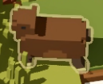                 | 사슴(Deer)                 | 모노레일 초지 | 5개의 완력 카트리지를 20초간 제공합니다.   | ✅              | 사슴이지만 소처럼 생겨서 소라고 불리기도 합니다.                                                                                                         |
|             | 악어(Crocodile)            | 화물 계곡     | 6개의 적재 카트리지를 20초간 제공합니다.   | ✅              | N/A                                                                                                                                                      |
|                | 개구리(Frog)               | 박스카 만     | 5개의 횃불 카트리지를 20초간 제공합니다.   | ❌              | 주변의 **거미줄을 먹어치웁니다**. 다가가면 통통 튀면서 도망가기 때문에 잡기 어렵습니다.                                                                  |
| 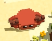                   | 게(Crab)                   | 환승섬        | 5개의 멀티툴 카트리지를 20초간 제공합니다. | ✅              | 게를 든 상태에서 물가(밀물 상태)로 이동하면 **육지가 생겨납니다**.                                                                                       |
| 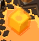 | 황무지 슬라임(Waste Slime) | 보일러 황무지 | 5개의 양동이 카트리지를 20초간 제공합니다. | ❌              | 슬라임은 열차를 **즉시 불태우는 능력**을 가지고 있기 때문에 열차에 근접하지 못하게 하는 관리가 필요합니다. 또한, 피격시 분열하는 특성을 가지고 있습니다. |

## Credits

본 문서는 다른 문서에 별다른 언급이 없는 한, 원본 Wiki의 라이센스 정책에 따라 [크리에이티브 커먼즈 저작자표시-동일조건변경허락 4.0 국제 라이센스](https://creativecommons.org/licenses/by-sa/4.0/)를 따릅니다.

[icon-speed]: ./media/icons/speed.png
[icon-wagon]: ./media/icons/wagon.png
[icon-water]: ./media/icons/water.png
[icon-bolt]: ./media/icons/bolt.png
[misc-checkmark]: ./media/misc/checkmark.png
[misc-crossmark]: ./media/misc/crossmark.png
