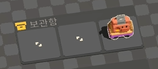

# 사전

> 이 문서는 **Unrailed 2 영문 커뮤니티 위키를 번역하여 필자의 사족을 덧붙여 옮겨온 문서입니다.** 내용에는 오역이 있을 수 있으며, 번역 과정에서 일부 정보가 생략됐을 수 있습니다.
>
> 원본 문서는 [Unrailed 2 Wiki](https://wiki.unrailed.gg/index.php/U2_Wiki)를 참조하세요.

이 문서는 알려진 Unrailed 2 정보를 정량적인 데이터로 참조할 수 있는 레퍼런스를 제공합니다.

메인 가이드와 더불어 교차 참조해주시면 더욱 풍부한 정보를 얻을 수 있습니다.

## 목차

- [사전](#사전)
  - [목차](#목차)
  - [기차역](#기차역)
    - [역 종류](#역-종류)
    - [역 난이도](#역-난이도)
      - [쉬움](#쉬움)
      - [보통](#보통)
      - [어려움](#어려움)
      - [극단](#극단)
    - [역 옵션](#역-옵션)
  - [카트리지](#카트리지)
  - [맵(바이옴)](#맵바이옴)
  - [열차](#열차)
  - [열차 확장](#열차-확장)
  - [엔진](#엔진)
  - [도구](#도구)
    - [도끼](#도끼)
    - [곡괭이](#곡괭이)
    - [양동이](#양동이)
  - [자원](#자원)
    - [압축된 자원](#압축된-자원)
  - [볼트](#볼트)
    - [볼트 파밍 방법](#볼트-파밍-방법)
  - [기차 속도](#기차-속도)
    - [기차 속도계](#기차-속도계)
    - [실제 속도](#실제-속도)
    - [역에서 출발시 준비 시간](#역에서-출발시-준비-시간)
    - [전략](#전략)
    - [초기 바이옴별 시작 속도](#초기-바이옴별-시작-속도)
    - [속도 증가율](#속도-증가율)
  - [급수량](#급수량)
    - [급수량 게이지](#급수량-게이지)
    - [하이드로차지 열차 확장 관련](#하이드로차지-열차-확장-관련)
    - [터렛차 관련](#터렛차-관련)
    - [물차 관련](#물차-관련)
  - [우유](#우유)
  - [Credits](#credits)

## 기차역

기차역(이하 역)은 역에서 역으로 이어진 맵(레벨) 하나를 클리어할 때마다 기차를 잠시 정차하고 재정비할 수 있는 장소입니다.

보스 클리어시 출현하는 환승역을 제외한 모든 역에는 기본적으로, **볼트 하나를 소모하여 도전할 수 있는 추가 과제 하나**와 **열차 또는 열차 확장을 최대 3개까지 보관할 수 있는 보관함**이 있습니다.

### 역 종류

### 역 난이도

역 난이도는 4개의 난이도로 나뉩니다. 맨 처음부터 시작하는 게임의 맵은 **쉬움** 난이도로 시작합니다.

역에 도착하면 다음 역으로 가는 발판 아래에 난이도 아이콘이 표시됩니다.

난이도가 더 높아질 수록 레벨 클리어시 더 많은 볼트를 획득할 수 있습니다.

#### 쉬움

**보상:  x1**

쉬움 난이도는 다음 역으로 가는 경로 사이에 장애물이 없습니다.

나무와 바위를 캐지 않아도 다음 역까지 진행할 수 있는 경로가 확보되어 있고, 산의 경우 단순하게 되어 있어 대부분의 경우 우회하지 않고도 다음 역에 도달할 수 있습니다.

땅과 땅 사이에 호수 물길이 있을 수 있지만 1개 타일을 넘지 않습니다.

도착하는 역이 상자역인 경우, 출현하는 무료 열차에 열차 능력치를 저하시키는 **디버프 열차 확장**이 들어있을 확률이 있습니다.

#### 보통

**보상:  x3**

보통 난이도는 일반적으로 나무와 바위 같은 자원이 다음 역으로 가는 경로를 막고 있습니다.

한편, 여전히 산으로 인해 경로를 우회해야 하는 경우는 드뭅니다.

또한, 호수가 넓지 않아 매우 긴 다리를 만드는 것이 강제되지 않습니다.

#### 어려움

**보상:  x4**

어려움 난이도는 더 많은 산과 호수로 이루어져 있습니다. 자원이 듬성듬성하게 배치되어 있어 자원 관리가 중요합니다.

한편, 산과 산 사이 좁은 통로로 전진해야 하는 경우는 많지 않습니다.

도착하는 역이 상자역인 경우, 출현하는 무료 열차에 열차의 능력치를 향상시키는 **일반 열차 확장**이 들어있을 확률이 있습니다.

#### 극단

**보상:  x5**

극단 난이도는 매우 드물게 출현하는 난이도로(어려움 카트리지가 없는 한) 맵 내에 자원이 매우 부족하게 배치되어 있습니다.

또한, 산과 산 사이에 기차만 겨우 지나갈 수 있는 한 칸짜리 좁은 통로가 최소 1개 이상 출현합니다.

극단 난이도에서 도착하는 역은 거의 항상 무료 카트리지를 제공하는 **카트리지역**이며, 그렇지 않은 경우 추가 **역 옵션**이 붙게 됩니다.

### 역 옵션

## 카트리지

## 맵(바이옴)

## 열차

## 열차 확장

## 엔진

## 도구

도구는 역에서 열차가 출발할 때 주어지는 아이템으로 나무나 철을 캐고 열차 열을 식히는데 사용합니다.

모든 도구는 던질 수 있습니다.

도구를 든 상태로 나무나 바위에 다가가면 자원을 캘 수 있습니다. 별도의 버튼을 누를 필요는 없습니다.

이 때, 캐릭터가 나무/바위를 3번 찍으면 자원으로 바뀝니다.

### 도끼

도끼는 맵에 펼쳐진 나무를 캐고 나무 자원을 획득하는데 사용합니다.

터보-도끼 카트리지를 활용하여 캐는 속도를 높일 수 있고, 멀티툴 카트리지를 활용해 바위도 캐는데 사용할 수 있습니다. 완력 카트리지를 얻으면 여러 나무를 한 번에 캘 수 있습니다.

NPC를 공격할 때 한 번의 공격으로 1데미지를 입힙니다.

### 곡괭이

곡괭이는 맵에 펼쳐진 바위를 캐고 돌 자원을 획득하는데 사용합니다.

터보-곡괭이 카트리지를 활용하여 캐는 속도를 높일 수 있고, 멀티툴 카트리지를 활용해 나무도 캐는데 사용할 수 있습니다. 완력 카트리지를 얻으면 여러 바위를 한 번에 캘 수 있습니다.

NPC를 공격할 때 한 번의 공격으로 1데미지를 입힙니다.

### 양동이

**물통**이라고도 불립니다.

양동이는 엔진의 급수량 게이지를 초기화시키거나 불이 났을 때 불을 끄는데 사용합니다.

언레일드 전작과 달리, 본작에선 양동이를 사용하려면 엔진에 대고 상호작용 키를 눌러야 합니다.

양동이를 들고 동물에게 다가가면 동물 [우유](#우유
)를 얻을 수 있습니다.

우유가 담긴 양동이를 든 플레이어 본인이 우유를 마시려면 양동이를 바닥에 내려놓고 도구를 든 상태로 상호작용 키를 눌러야 합니다. 이 때 양동이는 다시 손에 들리지 않습니다.

양동이에 담긴 우유는 가까이 다가가서 상호 작용키를 누르거나, 던지기를 활용해서 다른 플레이어에게 줄 수도 있습니다.

던지기 액션 카트리지를 장착한 플레이어는 다음과 같은 행동과 특성을 가집니다:

1. 양동이가 빈 경우, 다른 플레이어에게 바로 던지거나 우유차 또는 카트리지차에 던져 넣을 수 있습니다.
2. 양동이가 물로 채워져있을 경우, 1번을 포함하여 열차나 엔진에 던져 급수량 게이지를 초기화하거나 불을 끌 수 있고 이때 던진 양동이는 다시 손으로 돌아옵니다.
3. 양동이가 우유로 채워져있을 경우, 위 내용 모두 동일하나, 다른 플레이어에게 던질 경우 대상에게 우유를 먹이고 양동이가 다시 손으로 돌아옵니다.

## 자원

|형상|이름|역할|비고|
|-|-|-|-|
||나무|철로 제작, **물 위에 다리 만들기**|다음 라운드 시작시 육로로 넘어갈 수 있는 길이 없을 경우, 물을 건너가기 위한 길을 만들어야 하기 때문에 전 라운드에서 나무를 미리 모아두는 것을 추천합니다. (보일러 황무지 제외)|
||철(돌)|철로 제작|N/A|

열차 중 자원을 넣어야 동작하는 열차가 있습니다. 맥-트랙터와 같이 넣은 자원에 따라 효과가 달라지는 열차도 있습니다.

설정상으로는 필드의 바위를 캐면 나오는 자원이 철이라고 되어 있지만, 국내 커뮤니티에선 "돌"이라고 칭하는 경우가 많습니다. (필자도 돌로 알고 있었습니다..)

두더지 같은 적대 NPC를 잡으면 자원을 무더기로 떨구기도 합니다.

### 압축된 자원

압축된 자원은 조금 일반 자원보다 탁한 색을 띄고 있습니다. 압축된 자원은 일반 자원보다 5배의 효율을 가지고 있습니다. 다시 말해, 압축된 자원 1개를 넣으면 일반 자원 5개로 취급하기 때문에 압축된 자원 한 세트로 철로 5개를 만들 수 있습니다.

|형상|이름|역할|비고|
|-|-|-|-|
||압축된 나무|철로 제작, **물 위에 다리 만들기**|압축된 나무로 물 위에 다리를 만들 경우 2x2 크기로 만들어지기 때문에, 일반 나무로 만든 다리보다 더 효율적입니다.|
||압축된 철(돌)|철로 제작|N/A|

압축된 자원은 일반 자원과 함께 들 수 없습니다. 같은 종류의 자원끼리만 들 수 있습니다. 같은 맥락으로, 바닥에 내려놓을 때도 같은 종류의 자원끼리만 쌓아서 내려놓을 수 있습니다. (e.g., 일반 나무 1개 + 압축된 나무 2개 = 불가)

## 볼트

볼트는 매 게임 세션내에서 파밍할 수 있는 재화입니다. 볼트는 상점에서 열차나 열차 확장과 같은 업그레이드를 구매할 때 사용됩니다.

- **상점**에서 열차, 열차 확장 구입
- **대장간**에서 열차 업그레이드, 열차 확장 구입
- 각 **정거장**에서 유료 퀘스트 구입
- 보스룸 입장권 구입

### 볼트 파밍 방법

- 성공적으로 기차역에 도착하면 난이도에 따라 볼트를 얻을 수 있습니다. ([역 난이도별 볼트 개수](#역-난이도))
- 퀘스트 완수
- 맵에 랜덤하게 출현하는 볼트 1-2개 직접 획득
- 돼지차를 이용하여 파밍

## 기차 속도

기차 속도는 기차가 전진하는 속도를 의미합니다.

언레일드는 기차 속도를 **가상의 미터법(m)** 으로 표현하는데요, **1m**는 맵의 타일 1칸을 의미합니다.

### 기차 속도계

기차차의 현재 속도는 게임 화면의 상단에 표시되며, 다음과 같은 요소의 합산으로 계산됩니다:

- 엔진 자체의 시작 속도
- 바이옴의 시작 속도
- 현재까지 지나온 역의 수
- 바이옴 한 세트(모든 바이옴 한 번씩 돌기)를 반복한 횟수

보스전에 진입하면 기차 속도가 특정 속도로 고정되거나 일정한 규칙에 따라 느려집니다.

기차의 속도는 역에 도달할 때마다 증가하며, 역과 역 사이 구간에선 속도가 일정하게 유지됩니다.

또한, 기차 속도는 플레이어 수에 따라 변화합니다. 플레이어 수가 많아질 수록 기차차 속도가 더 빨라집니다. 이는 풀방이 아닌 상태로 게임을 진행하다 플레이어가 난입하는 경우에도 실시간으로 적용되며 기차차 속도가 갑자기 빨라질 수 있습니다.

바이옴 사이클을 한 바퀴 돈 이후, 이미 플레이한 바이옴에 다시 방문할 경우 방문한 횟수 만큼 기본 시작 속도가 0.5m/s로 증가합니다.

[WIP: 이 내용은 아직 검증되지 않았습니다; 일부 소스에선 2번째 바이옴 시작 속도가 0.261m/s로 나와서 검증이 필요합니다.]

### 실제 속도

대부분의 경우, 기차의 **실제 속도**는 기차 속도계에 표현된 것과 완전히 동일하지 않을 수 있습니다.

기차의 실제 속도는 기차 앞에 놓아진 철로의 개수에 따라 가변적으로 변화합니다.

기차 앞에 철로가 3개 이하로 놓인 경우 현재 속도계에 표시된 속도보다 느리게 움직입니다.

### 역에서 출발시 준비 시간

기차가 역에서 출발하기 전, **15초의 준비 시간**이 주어집니다.

이 때, 기차는 도착한 역의 타일에서 0.5m 만큼 전진한 상태로 시작합니다.

만약 플레이어가 출발 준비 시간 도중에 철로를 10개를 초과하여 연결할 경우, **초과된 철로의 개수 만큼 1초씩 준비 시간이 줄어듭니다**.

여기서 주의할 점은, 시작 지점에 따라 역에서 출발하는 기차 앞에 2-3개의 철로가 미리 깔려있다는 점입니다.

`2025-03-08` 기점으로 현재 버그인지 확인되지는 않았으나, 0.5m 만큼 전진한 상태 + 2-3개의 철로가 미리 깔려있기 때문에 6-7개를 초과하는 철로를 연결할 경우 출발 카운트다운이 갑자기 끝나는 현상이 발생할 수 있습니다.

랭크런에서 기차 속도가 10m/s가 넘는 경우, 철로 개수를 잘못 계산하여 일찍 출발하면 정지차 사용 타이밍이 틀어져 참사가 발생하므로, 위 내용을 상기하여 철로를 6개까지만 미리 연결하는 것이 안전합니다.

### 전략

실제 속도 특성을 활용하여, 시간을 벌어야 할 때, 철로를 기차 앞 3칸까지만 연결하여 기차 속도를 낮추는 방법이 있습니다. 한편, 이 방법은 최후의 수단으로 버티기를 할 때 사용하는 것이 좋습니다.

또한, 철길을 꼬아 루프를 만드는 방법도 시간 벌기에 효과적입니다. 단, 이렇게 철길을 꼬는 방법은 많은 자원 소모가 필요하므로 주의가 필요합니다.

그 외에도 정지차를 활용하여 기차 속도를 늦추는 방법도 있습니다.

### 초기 바이옴별 시작 속도

게임을 처음 시작할 때 선택한 시작 바이옴에 따라 기차 출발 속도가 달라집니다.

이 속도는 시작 바이옴에 따라 N개의 역을 반복한 횟수 만큼으로 결정됩니다.

|바이옴|시작 속도 지점 (역 개수)|
|-|-|
|모노레일 초지|0개|
|화물 계곡|2개|
|박스카 만|2개|
|환승섬|3개|
|보일러 황무지|4개|

### 속도 증가율

아래는 시작 역에 따른 기차의 기반 속도와 플레이어 수에 따른 속도 변화를 나타내는 표입니다.

|역 개수|1명|2명|3명|4명|
|-|-|-|-|-|
|1|0.040|0.050|0.080|0.100|
|2|0.046|0.056|0.087|0.108|
|3|0.056|0.066|0.098|0.119|
|4|0.067|0.077|0.111|0.133|
|5|0.079|0.089|0.125|0.147|
|6|0.092|0.102|0.140|0.163|
|7|0.106|0.116|0.156|0.180|
|8|0.120|0.130|0.173|0.198|
|9|0.136|0.146|0.190|0.217|
|10|0.152|0.162|0.209|0.237|
|11|0.169|0.179|0.229|0.258|
|12|0.187|0.197|0.250|0.280|
|13|0.206|0.216|0.272|0.304|
|14|0.227|0.237|0.295|0.328|
|15|0.249|0.259|0.321|0.355|
|16|0.273|0.283|0.347|0.383|
|17|0.298|0.308|0.376|0.413|
|18|0.325|0.335|0.407|0.446|
|19|0.355|0.365|0.440|0.480|
|20|0.388|0.398|0.476|0.518|
|21|0.424|0.434|0.515|0.559|
|22|0.463|0.473|0.558|0.604|
|23|0.507|0.517|0.606|0.653|
|24|0.555|0.565|0.658|0.706|
|25|0.609|0.619|0.716|0.766|
|26|0.670|0.680|0.780|0.832|
|27|0.738|0.748|0.852|0.906|
|28|0.815|0.825|0.933|0.988|
|29|0.902|0.912|1.024|1.081|
|30|1.001|1.011|1.126|1.186|
|31|1.113|1.123|1.243|1.304|
|32|1.241|1.251|1.375|1.438|

## 급수량

엔진은 움직일 때마다 급수량 게이지가 감소합니다. 급수량 게이지가 다 떨어지면 엔진이 불에 타게 됩니다.

양동이를 이용하여 급수량 게이지를 즉시 초기화할 수 있습니다.

엔진마다 급수량이 다릅니다. 자세한 내용은 [엔진](#엔진)을 참조하세요.

**엔진과 개별 열차를 불문하고, 불에 타는 열차는 인접한 열차를 불 태울 수 있습니다.**

특히, 제작차가 불탈 경우 게임 진행에 매우 치명적이기 때문에 양동이 이용하여 급수량 게이지를 초기화하는 것이 중요합니다.

한편, **엔진 자체**는 다른 인접한 열차가 불에 탄다고 해서 더 빨리 불에 타지 않습니다.

||||
|-|-|-|
|열차|열차(🔥화르륵)|**엔진**|

같은 맥락으로, 연속된 3개의 열차의 양쪽 열차가 불에 타는 경우 그 사이에 낀 열차는 2배의 속도로 불에 타지 않습니다.

아래 그림에서 **열차B**는 양쪽이 불탄다고 해서 더 빨리 **불에 타지 않습니다**.

|||||
|-|-|-|-|
|열차A(🔥화르륵)|**열차B**|열차C(🔥화르륵)|엔진|

### 급수량 게이지

게임 내에선 표시되지 않지만, 모든 열차는 숨겨진 급수량 게이지를 가지고 있습니다.

터렛을 제외한 대부분의 열차는 따로 하이드로차지 열차 확장이 없다는 가정하에 초기 급수량이 30초입니다.

하이드로차지 열차 확장을 추가할 경우, 확장을 추가할 때마다 열차의 급수량 게이지를 20초 증가시킵니다.

여기서 주의할 점은 언급된 30초가 실제 시간 30초를 의미하지 않습니다. 하이드로차지 열차 확장의 경우 개수가 늘어날 때마다 곱연산으로 물 소모량이 증가하기 때문에 실제로는 동일한 시간이 소요됩니다.

예를 들어, 열차에 하이드로차지 3개를 도배했다면, 열차는 `30초 + 20초 * 3 = 90초`의 급수량을 가지게 됩니다. 한편, 열차가 활성화된 상태라면 3배의 속도로 급수량 게이지가 감소하므로 `90초 / 3 = 30초`가 되어 열차가 불에 타기까지 걸리는 시간은 변하지 않습니다.

숨겨진 급수량 게이지는 인접한 열차가 불에 탈 경우 점점 감소합니다. (열차가 달궈지는듯한 시각 효과가 있습니다)

열차가 불에 타기 전에 인접한 열차의 불이 꺼진 경우 숨겨진 급수량 게이지는 자동으로 회복되긴 하지만, 불에 달궈진 시간만큼 기다려야 완전히 회복됩니다.

예를 들어, 열차가 인접한 불타는 열차에 의해 20초 동안 달궈졌다 불이 꺼질 경우, 숨겨진 급수량 게이지는 20초만큼 감소했다가 다시 20초에 걸쳐 회복됩니다.

### 하이드로차지 열차 확장 관련

하이드로차지 열차 확장을 사용할 경우 사용한 열차가 활성화 상태일 때를 기준으로 **급수량** 게이지가 감소합니다.

여기서 "활성화 상태"란, 제작차를 기준으로 철로를 제작할 때와 같이 뭔가 일을 하는 상태를 뜻합니다.

따라서, 하이드로차지를 사용했다 하더라도 열차가 활성화 상태가 아니라면 급수량 게이지가 감소하지 않습니다.

하이드로차지가 중첩될 경우 급수량 게이지 감소량은 곱연산으로 계산됩니다.

### 터렛차 관련

터렛차의 경우 급수량 게이지가 기본적으로 달려있습니다.

따라서, 열차 확장도 하이드로차지로 도배하는 것이 이득입니다.

### 물차 관련

물차를 제외한 모든 열차는 급수량은 서로 분리되어 있습니다.

물차의 급수량 게이지는 열차 전체의 급수량처럼 공유됩니다.

물차가 여러 대 있을 경우, 모든 물차의 급수량 게이지가 합쳐진 용량이 열차의 급수량 게이지가 됩니다.

각 열차는 물차의 급수량 게이지를 먼저 소모하고 나서 자신의 급수량 게이지를 소모합니다.

이는 물차 자신도 마찬가지라서, 물차가 물을 모두 소모한 시점에 인접한 열차에서 불이 날 경우 물차에 불이 붙을 때까지 다시 30초가 더 필요하다는 것을 의미합니다.

만약, 엔진을 포함하여 급수량 게이지가 표시되는 하이드로차지 열차 확장이 적용된 열차는 물차에 물이 남아있는 동안 급수량 게이지가 회복됩니다.

예를 들어, 레벨4 물차는 60초의 급수량을 가지는데, 엔진도 60초의 급수량을 가지고 있다고 하면, 엔진과 물차 모두 물이 바닥난 상황에서 불이 붙기 시작할 때 물차에 물을 채우면 엔진은 물차의 급수량을 우선적으로 사용하게 되고, 그 사이에 엔진의 바닥난 급수량 게이지가 다시 회복됩니다. 그래서 60초가 지나 물차의 물이 바닥날 때 쯤이면 엔진의 급수량 게이지가 완전히 회복되어 다시 60초의 시간을 더 버틸 수 있게 됩니다.

하이드로차지가 함께 사용될 경우, 또 다른 예시로:
레벨1 물차가 30초 급수량을 가지고, 엔진이 60초 급수량을 가지는 상황에 활성화된 열차가 3개의 하이드로차지를 가지고 있을 경우, 물차는 물이 바닥날 때까지 `30초 / 4 = 7.5초`를 버틸 수 있습니다. 이후 30초가 지나면 열차가 불에 타기 시작하고, 다시 30초가 지나면 엔진이 불에 타기 시작합니다.

## 우유

우유는 플레이어가 마시면 일시적으로 특별한 버프(카트리지 버스트)를 주는 기능을 합니다.

우유는 양동이를 든 상태에서 **착유할 수 있는 동물**에게 다가가 기다리면 획득할 수 있습니다.

우유를 획득하는 다른 방법으로는 **우유차**가 있습니다. 우유차 위에 양동이를 올려두거나 우유차 몸체에 대시를 사용하면 우유를 획득할 수 있습니다.

획득한 우유는 던지기를 사용하여 다른 플레이어에게 사용하거나, 직접 다른 플레이어에게 다가가 상호작용 키를 눌러 사용할 수 있습니다.

우유를 직접 마시려면 바닥에 우유가 담긴 양동이를 내려놓고 **도구**를 든 상태로 그 위에 서서 상호작용 키를 누르면 됩니다.

우유 버프는 **20초**간 지속되며, 우측 하단에 장착된 카트리지를 보여주는 UI에 버프 내용에 따라 카트리지가 일시적으로 추가된 것으로 표시됩니다. 해당하는 카트리지는 시간이 지남에 따라 회색으로 변하며, 버프가 끝나면 일시적으로 얻은 카트리지는 사라집니다.

그리고 놀랍게도, 우유는 버프 외에도 양동이에 담긴 물과 동일한 기능을 가지기 때문에 급할 때 **기차의 불을 끄는데 사용할 수도 있습니다**.

우유를 얻을 수 있는 동물 리스트는 다음과 같습니다:

|동물|이름|출현 지역|효과|탑승 가능 여부|비고|
|-|-|-|-|-|-|
||사슴(Deer)|모노레일 초지|5개의 완력 카트리지를 20초간 제공합니다.|✅|사슴이지만 소처럼 생겨서 소라고 불리기도 합니다.|
||악어(Crocodile)|화물 계곡|6개의 적재 카트리지를 20초간 제공합니다.|✅|N/A|
||개구리(Frog)|박스카 만|5개의 횃불 카트리지를 20초간 제공합니다.|❌|주변의 **거미줄을 먹어치웁니다**. 다가가면 통통 튀면서 도망가기 때문에 잡기 어렵습니다.|
||게(Crab)|환승섬|5개의 멀티툴 카트리지를 20초간 제공합니다.|✅|게를 든 상태에서 물가(밀물 상태)로 이동하면 **육지가 생겨납니다**.|
||황무지 슬라임(Waste Slime)|보일러 황무지|5개의 양동이 카트리지를 20초간 제공합니다.|❌|슬라임은 열차를 **즉시 불태우는 능력**을 가지고 있기 때문에 열차에 근접하지 못하게 하는 관리가 필요합니다. 또한, 피격시 분열하는 특성을 가지고 있습니다.|

## Credits

본 문서는 다른 문서에 별다른 언급이 없는 한, 원본 Wiki의 라이센스 정책에 따라 [크리에이티브 커먼즈 저작자표시-동일조건변경허락 4.0 국제 라이센스](https://creativecommons.org/licenses/by-sa/4.0/)를 따릅니다.

